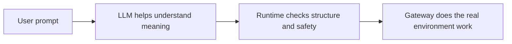

# Runtime Overview For Humans

This document explains the runtime in the simplest useful way.

It is written for someone who wants to understand the system without already
thinking like a compiler, a planner, or a distributed systems engineer.


## What This System Is

This system takes a plain-language request and tries to turn it into a safe,
structured set of actions.

It is **not** a design where the LLM freely writes shell commands and the
machine blindly runs them.

Instead:

- the **LLM** helps understand what the user means
- the **runtime** checks whether that interpretation is allowed and well-formed
- the **gateway** performs the real environment-facing work in a bounded way


## What Happens When You Type A Prompt

Imagine the user says:

```text
how much free memory do i have on this system?
```

Very roughly, this is what happens:

1. The system reads the prompt.
2. The LLM helps decide what kind of request it is.
3. The runtime turns the request into one or more tasks.
4. The runtime chooses a capability that can do each task.
5. Safety rules check whether execution is allowed.
6. Sometimes the runtime notices that a later question is already answered by
   an earlier result, so it does not create an extra action just to restate it.
7. The capability runs.
8. The result is turned into a clean final answer.


## Who Does What

### The LLM

The LLM is used to help with meaning.

It answers questions like:

- What is the user trying to do?
- How many tasks are hidden inside this prompt?
- Is this about memory, files, SQL, or something else?
- Which of these candidate capabilities semantically fits best?

The LLM does **not** get final authority over execution.


### The Runtime

The runtime is the rule-enforcing part.

It does things like:

- validate structured LLM output
- restrict object types to known vocabulary
- shortlist real registered capabilities
- check deterministic compatibility
- reason about declared capability outputs, not just inputs
- build a typed action graph
- enforce safety policy
- pause for confirmation when required
- render the final answer


### The Gateway

The gateway is the part that touches the real environment.

For example, it can do bounded work like:

- list files
- read files
- write a file inside the workspace
- inspect system memory
- inspect system CPU load

The gateway is important because it gives the runtime a controlled place to do
real work without letting arbitrary text turn into arbitrary machine actions.


## Why This Is Safer Than “LLM Writes Commands”

If a system lets the LLM directly invent and run commands, several bad things
become more likely:

- it may misunderstand the request
- it may invent tools that do not exist
- it may use the wrong file or wrong directory
- it may mix up explanation and execution
- it may do something unsafe or irreversible

This runtime adds guardrails between meaning and action:

- structured schemas
- capability manifests
- deterministic validation
- workspace-bounded paths
- confirmation gates for mutation
- output redaction and safe previews


## One Simple Mental Model

You can think of the system as three cooperating parts:




## Important Terms

### Prompt

The sentence or question the user types.

### Task

One piece of work the runtime extracts from the prompt.

If the user says:

```text
get the memory report and save it to report.txt
```

that usually becomes two tasks:

- get the memory report
- save it to a file

### Capability

A named thing the runtime knows how to do.

Examples:

- `system.memory_status`
- `filesystem.read_file`
- `filesystem.write_file`

Capabilities also say what they return in a structured way. For example,
`filesystem.write_file` can return the full saved path, which means the runtime
may not need a second tool call just to answer “where did you save it?”

### DAG

Short for “directed acyclic graph.”

In this system it simply means:

> a validated graph of actions and dependencies

If task 2 needs task 1 to finish first, the DAG remembers that.

### Gateway

The controlled environment-facing execution layer.

### Result Bundle

The collected execution results for the DAG.

### Confirmation

A pause that asks the user for approval before a risky or mutating action runs.

For example, writing a file is confirmation-gated.


## What This Docs Suite Explains Next

If you want the precise flow, go next to:

- [02_request_lifecycle.md](02_request_lifecycle.md)

If you want one concrete example before the full reference, go to:

- [06_worked_example_memory_report.md](06_worked_example_memory_report.md)
