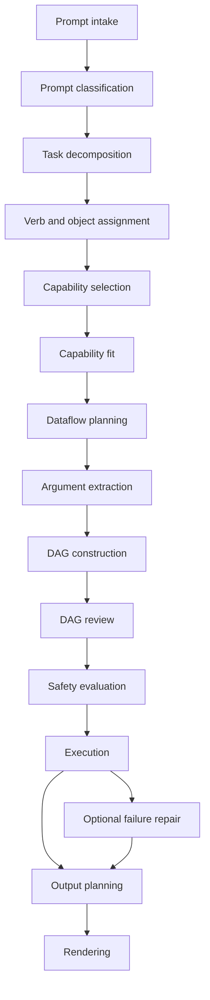

# Request Lifecycle

This document explains the current request lifecycle stage by stage.

It focuses on the typed runtime path used by Open WebUI and
`POST /v1/chat/completions`.

## Lifecycle At A Glance

## A Note About LLM Usage

Some stages are **LLM-assisted** and some are **deterministic**.

The runtime pattern is:

1. ask the LLM for a typed proposal
2. validate it against a schema
3. normalize and constrain it deterministically
4. reject or repair it if it does not fit trusted rules

## 0. Prompt Intake

**Where:** `src/aor_runtime/api/app.py`

**Purpose**

Turn the incoming OpenAI-compatible chat payload into the latest actionable user
prompt.

**Inputs**

- OpenAI-style messages
- runtime context such as `workspace_root`

**Outputs**

- plain prompt text
- runtime context passed into `AgentRuntime.handle_request(...)`

**LLM step:** No

**Deterministic follow-up**

- ignore Open WebUI helper prompts such as title/tag generation prompts
- detect approval or cancel messages for confirmation replay

## 1. Prompt Classification

**Where:** `src/agent_runtime/input_pipeline/decomposition.py`

**Purpose**

Decide what kind of request this is and whether tools are needed.

**Inputs**

- raw user prompt

**Outputs**

- prompt type
- likely domains
- risk level
- clarification hint

**LLM step:** Yes

**Deterministic validation after the LLM**

- schema validation
- normalization of obvious runtime/system prompt shapes
- compatibility checks on the classification payload

**Failure or fallback**

- malformed proposals are rejected
- obvious deterministic hints can still shape the accepted classification

## 2. Task Decomposition

**Where:** `src/agent_runtime/input_pipeline/decomposition.py`

**Purpose**

Break one prompt into one or more task frames.

**Inputs**

- raw prompt
- classification context

**Outputs**

- list of `TaskFrame`-like task descriptions
- dependencies between tasks
- global constraints

**LLM step:** Yes

**Deterministic validation after the LLM**

- task shape validation
- dependency sanity checks
- normalization into trusted task frames

**Failure or fallback**

- the runtime can run an advisory **decomposition critique**
- if critique finds meaningful issues, the runtime can ask the LLM for one
  repaired decomposition attempt before continuing

## 3. Verb And Object Assignment

**Where:** `src/agent_runtime/input_pipeline/verb_classification.py`

**Purpose**

Assign each task a semantic verb and a known object type.

**Inputs**

- validated tasks
- likely domains
- registry-derived object vocabulary

**Outputs**

- semantic verbs such as `read`, `create`, `update`, `analyze`
- constrained object types such as `system.memory` or `filesystem.file`

**LLM step:** Yes

**Deterministic validation after the LLM**

- object types are constrained to runtime-known vocabulary
- loose phrasing is normalized toward known families
- risk hints are bounded

**Failure or fallback**

- invented free-form object labels are rejected or normalized

## 4. Capability Selection

**Where:** `src/agent_runtime/input_pipeline/domain_selection.py`

**Purpose**

Choose which registered capability should be tried for each task.

**Inputs**

- typed tasks
- capability registry
- likely domains and object types

**Outputs**

- shortlisted candidates
- selected candidate or unresolved reason

**LLM step:** Yes, but bounded

The runtime first builds a deterministic shortlist. The LLM then judges that
candidate set instead of inventing arbitrary capability ids.

**Deterministic validation after the LLM**

- candidate ids must already exist in the shortlist
- operation ids must match the registry manifest
- selection results stay within trusted registered capabilities

**Failure or fallback**

- unresolved tasks stay unresolved instead of inventing fake capabilities

## 5. Capability Fit

**Where:** `src/agent_runtime/input_pipeline/capability_fit.py`

**Purpose**

Check whether the selected capability truly fits the task.

**Inputs**

- typed task
- selected capability
- manifest metadata
- classification context

**Outputs**

- fit decision
- deterministic rejection reasons when relevant
- user-facing capability gaps when no safe fit exists

**LLM step:** Yes

The LLM returns a **binary fit judgment** plus reasons.

**Deterministic validation after the LLM**

- canonical domain compatibility
- canonical object-family compatibility
- semantic verb compatibility
- hard safety conflicts
- argument feasibility

**Failure or fallback**

- malformed structured LLM output is recorded with diagnostics
- strong deterministic compatibility can still accept a candidate even if the
  LLM response is unavailable or ambiguous

## 6. Dataflow Planning

**Where:** `src/agent_runtime/input_pipeline/dataflow_planning.py`

**Purpose**

Decide whether one task should consume another task’s output through typed
references.

**Inputs**

- fit-approved tasks
- selected capabilities
- registry manifests

**Outputs**

- accepted producer-consumer refs
- rejected refs
- optional derived internal data tasks

**LLM step:** Yes, when dataflow planning is actually needed

**Deterministic validation after the LLM**

- no self-references
- only wire compatible producer/consumer shapes
- only wire true dataflow-like arguments

**Failure or fallback**

- bogus refs are rejected and recorded in observability
- single-step requests can skip this stage entirely

## 7. Argument Extraction

**Where:** `src/agent_runtime/input_pipeline/argument_extraction.py`

**Purpose**

Fill validated capability arguments from the prompt, constraints, and upstream
refs.

**Inputs**

- fit-approved tasks
- selected capabilities
- manifests
- dataflow plan

**Outputs**

- typed argument payloads for each selected capability
- missing required argument lists when extraction is incomplete

**LLM step:** Yes

**Deterministic validation after the LLM**

- manifest argument schema validation
- workspace path normalization
- known format inference such as `report.md` -> `markdown`
- `input_ref` wiring for upstream data

**Failure or fallback**

- incomplete arguments are surfaced before execution
- unsafe or schema-invalid values are rejected

## 8. DAG Construction

**Where:** `src/agent_runtime/input_pipeline/dag_builder.py`

**Purpose**

Build the trusted `ActionDAG`.

**Inputs**

- tasks
- selected capabilities
- extracted arguments
- dataflow plan

**Outputs**

- typed action nodes
- dependency edges

**LLM step:** No

**Deterministic work**

- build node ids
- attach dependencies
- attach typed arguments
- derive confirmation metadata

**Failure or fallback**

- invalid DAG shape stops execution before safety or runtime work begins

## 9. DAG Review

**Where:** `src/agent_runtime/input_pipeline/planning_review.py`

**Purpose**

Run an advisory review over **sanitized** DAG metadata.

**Inputs**

- original prompt
- sanitized DAG metadata
- safe capability summaries

**Outputs**

- missing user intents
- suspicious nodes
- dependency warnings
- output expectation warnings

**LLM step:** Yes, advisory only

**Deterministic validation after the LLM**

- referenced node ids must exist
- review output cannot directly mutate the trusted DAG

**Failure or fallback**

- if review fails, the runtime continues with a zero-confidence empty review

## 10. Safety Evaluation

**Where:** `src/agent_runtime/execution/safety.py`

**Purpose**

Decide whether the DAG is allowed to run and whether confirmation is required.

**Inputs**

- trusted DAG
- capability registry
- runtime config

**Outputs**

- `allowed`
- `requires_confirmation`
- warnings
- blocked reasons
- sanitized DAG

**LLM step:** No

**Deterministic work**

- check manifest operation correctness
- enforce gateway routing for environment-facing capabilities
- enforce workspace-bounded paths
- enforce secret-path blocking
- clamp selected argument classes
- require confirmation for mutating capabilities like `filesystem.write_file`

**Failure or fallback**

- blocked DAGs do not execute
- confirmation-gated DAGs pause instead of pretending they failed

## 11. Execution

**Where:** `src/agent_runtime/execution/engine.py`

**Purpose**

Execute trusted DAG nodes.

**Inputs**

- execution-ready DAG
- execution context

**Outputs**

- `ResultBundle`
- per-node `ExecutionResult`s

**LLM step:** No

**Deterministic work**

- topological execution
- internal capability execution
- local capability execution
- gateway-backed capability execution
- result-store population for larger outputs and data refs

**Failure or fallback**

- node failures are stored in the result bundle
- if the only reason execution cannot continue is confirmation, the bundle is
  marked as waiting for confirmation rather than as a fake hard failure

## 12. Optional Failure Repair

**Where:** `src/agent_runtime/execution/failure_repair.py`

**Purpose**

Attempt one safe advisory repair after certain execution failures.

**Inputs**

- original prompt
- failed node
- sanitized failure metadata
- manifest summary

**Outputs**

- optional repaired DAG
- repair metadata

**LLM step:** Yes, optional

**Deterministic validation after the LLM**

- repaired node id must match the failed node
- no arbitrary shell text injection
- alternate capability proposals must pass deterministic capability fit
- repaired DAG must pass safety again
- repair may not bypass confirmation

**Failure or fallback**

- unsupported repairs are rejected and recorded
- repair is skipped entirely for confirmation pauses

## 13. Output Planning

**Where:** `src/agent_runtime/output_pipeline/display_selection.py`

**Purpose**

Choose how to present safe execution results.

**Inputs**

- original prompt
- DAG summary
- result summary
- safe previews only

**Outputs**

- `DisplayPlan`

**LLM step:** Yes

**Deterministic validation after the LLM**

- display type must be allowed
- section references must point to real available node ids or data refs
- the LLM cannot invent unavailable results

**Failure or fallback**

- if display-plan selection fails, the runtime falls back to deterministic
  result-shape rendering

## 14. Rendering

**Where:** `src/agent_runtime/output_pipeline/`

**Purpose**

Turn normalized results or a display plan into the final assistant text.

**Inputs**

- display plan or deterministic result shapes
- normalized outputs

**Outputs**

- final markdown/text response

**LLM step:** No for the final rendering itself

**Deterministic work**

- render tables
- render file previews as code blocks
- render saved-file confirmations
- render capability lists
- render deterministic fallback views

**Failure or fallback**

- if LLM display planning fails, deterministic rendering still produces a
  truthful answer from the normalized result shapes

## The Most Important Pattern

Across the whole lifecycle, the same pattern repeats:

1. ask the LLM for a typed proposal when meaning is fuzzy
2. validate and constrain that proposal deterministically
3. execute only trusted, typed, validated actions

That pattern is the core of the runtime.
