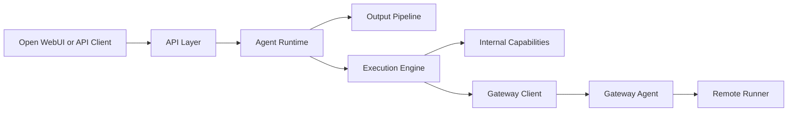
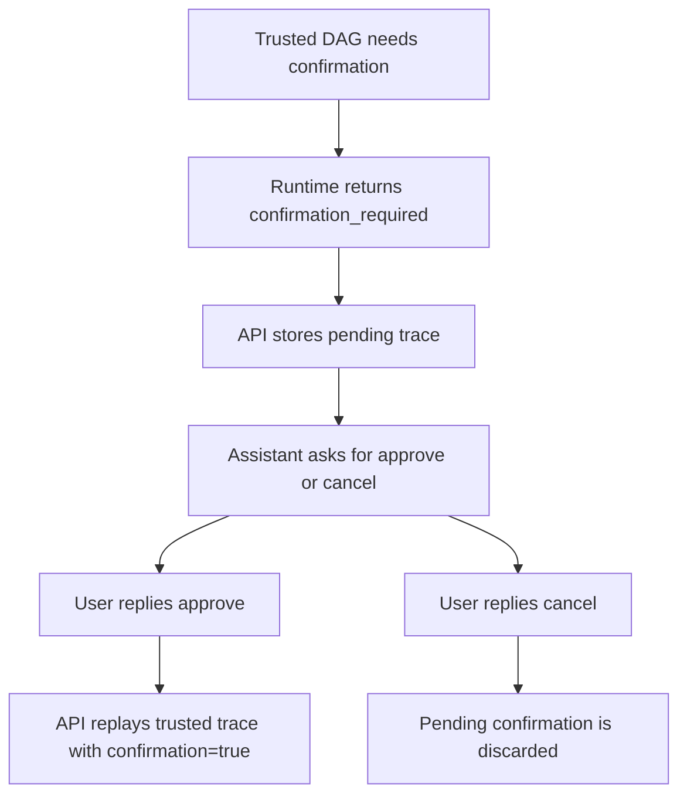

# Components And Boundaries

This document explains the major subsystems, what each one owns, and where the
hard boundaries are.

The goal is to make it easy to answer questions like:

- Where does user intent become typed structure?
- What can the LLM influence?
- What is deterministic?
- What actually touches the machine?

## Top-Level Boundary Map

## Component Summary

| Component | Main Location | What It Owns | What It Does Not Own |
| --- | --- | --- | --- |
| API layer | `src/aor_runtime/api/app.py` | HTTP endpoints, OpenAI-compatible chat, confirmation handshake | semantic planning, capability execution internals |
| Agent runtime | `src/agent_runtime/core/orchestrator.py` | request pipeline orchestration | raw environment access |
| Input pipeline | `src/agent_runtime/input_pipeline/` | task understanding and planning artifacts | actual execution |
| Capability registry | `src/agent_runtime/capabilities/` | trusted capability definitions | user-facing orchestration |
| Execution engine | `src/agent_runtime/execution/` | trusted DAG execution and result storage | high-level semantic interpretation |
| Output pipeline | `src/agent_runtime/output_pipeline/` | result-shape normalization, display planning, rendering | execution and capability routing |
| Observability | `src/agent_runtime/observability/` | event emission, safe formatting, Open WebUI trace layout | trusted planning decisions |
| Gateway agent | `gateway_agent/` | bounded environment-facing operations | prompt interpretation |

## API Layer

**Main file:** `src/aor_runtime/api/app.py`

### Responsibilities

- expose `GET /healthz`
- expose `GET /v1/models`
- expose `POST /v1/chat/completions`
- parse chat messages into one actionable user prompt
- maintain the generic confirmation pause/resume flow
- preserve older compatibility endpoints

### Boundary

The API layer does not decide capability fit or DAG safety. It delegates that to
the agent runtime.

### Important current truth

- `POST /v1/chat/completions` uses the typed agent runtime
- older `/runs` and `/sessions` endpoints still use a simpler compatibility
  engine

## Agent Runtime Orchestrator

**Main file:** `src/agent_runtime/core/orchestrator.py`

### Responsibilities

- own the end-to-end request lifecycle
- call each planning stage in order
- keep planning trace and last-plan state
- invoke safety, execution, repair, and output composition
- emit observability events

### Boundary

The orchestrator owns control flow, but it does not define every low-level rule.
Those rules live in the stage modules, capability manifests, and safety policy.

## Input Pipeline

**Directory:** `src/agent_runtime/input_pipeline/`

### Responsibilities

- classification
- decomposition
- verb/object assignment
- capability selection
- capability fit
- dataflow planning
- argument extraction
- DAG construction
- DAG review

### Boundary

The input pipeline produces trusted planning artifacts. It does not run the
environment itself.

### LLM involvement

This is the heaviest LLM area in the system, but every structured response is
validated and bounded before it becomes trusted runtime state.

## Capability Registry

**Directory:** `src/agent_runtime/capabilities/`

### Responsibilities

- define capability manifests
- keep the trusted registry of what can be executed
- separate internal, local, and gateway-backed capabilities

### Boundary

If a capability is not registered here, the runtime should not invent it and
should not execute it.

## Execution Engine

**Directory:** `src/agent_runtime/execution/`

### Responsibilities

- execute a trusted DAG
- route gateway-backed capabilities through the gateway client
- store results in the result store
- return a `ResultBundle`

### Boundary

The execution engine assumes planning is already trusted. It does not interpret
raw user prompts.

## Result Store

**Main file:** `src/agent_runtime/execution/result_store.py`

### Responsibilities

- keep larger or structured outputs addressable by reference
- resolve `input_ref` links for downstream tasks
- separate full stored outputs from safe previews used for display planning

### Boundary

The result store is about typed dataflow and retrieval, not user-facing
rendering.

## Output Pipeline

**Directory:** `src/agent_runtime/output_pipeline/`

### Responsibilities

- normalize execution results into typed result shapes
- ask the LLM for a display plan using safe previews
- validate display references
- render deterministic markdown/text output
- fall back gracefully when display planning fails

### Boundary

The output pipeline does not invent unavailable results and does not re-run
capabilities.

## Gateway And Remote Runner

**Main files:** `gateway_agent/app.py`, `gateway_agent/remote_runner.py`

### Responsibilities

- accept bounded remote operations
- normalize paths
- enforce workspace limits
- block obvious secret paths
- run constrained filesystem, shell, and system operations

### Boundary

The gateway does real environment-facing work, but only through explicit,
registered backend operations.

It does not decide what the user meant.

## Observability

**Directory:** `src/agent_runtime/observability/`

### Responsibilities

- emit stage and event records
- redact or bound sensitive previews
- format the Open WebUI trace cleanly in markdown

### Boundary

Observability explains what happened. It does not change trusted runtime
decisions.

## Confirmation Layer

**Main files:** `src/aor_runtime/api/app.py`,
`src/agent_runtime/core/orchestrator.py`

### Responsibilities

- detect when a trusted plan requires approval
- pause execution without pretending it failed
- store pending confirmation context
- resume trusted execution on `approve`
- cancel pending work on `cancel`

### Boundary

Confirmation is not a repair and not a replan. It is a pause on a trusted plan.

## The Three Most Important Boundaries

### 1. Meaning vs Trust

The LLM helps interpret meaning. The runtime decides what becomes trusted.

### 2. Trusted Plan vs Real Environment

The execution engine and gateway only see trusted, typed, validated actions.

### 3. Full Data vs Safe Display

The result store may hold richer outputs, but the output planner only sees safe
previews and validated references.
