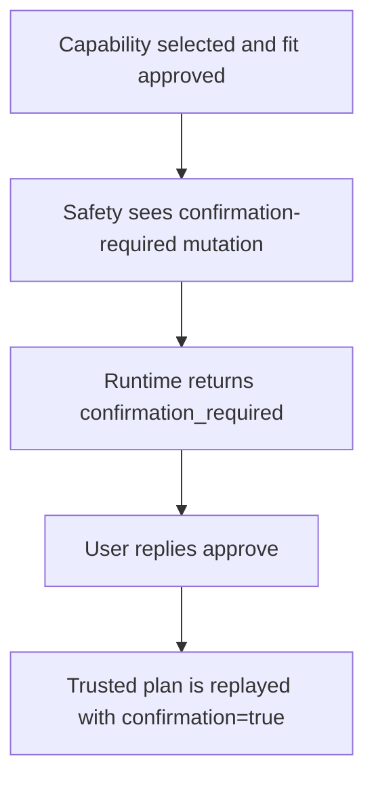
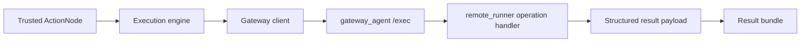

# Capabilities, Safety, And Gateway

This document explains how the runtime models capabilities, how those
capabilities are gated by safety policy, and how gateway-backed work reaches the
real environment.

## What A Capability Is

A capability is a named, trusted action the runtime knows how to plan and
execute.

Examples:

- `system.memory_status`
- `filesystem.read_file`
- `filesystem.write_file`
- `runtime.describe_capabilities`

Each capability has a manifest that describes:

- capability id
- domain
- operation id
- semantic verbs
- object types
- required and optional arguments
- output schema
- execution backend
- risk level
- whether it is read-only
- whether it mutates state
- whether confirmation is required

The registry is built in:

- `src/agent_runtime/capabilities/__init__.py`

## Current Built-In Capability Families

This pass documents the core families rather than every single manifest field of
every single capability.

### Runtime Introspection

Examples:

- `runtime.describe_capabilities`
- `runtime.describe_pipeline`
- `runtime.show_last_plan`
- `runtime.explain_last_failure`

These are internal, read-only capabilities for understanding the runtime
itself.

### Structured Data Helpers

Examples:

- `data.aggregate`
- `data.project`
- `data.head`
- `python_data.transform_table`
- `markdown.render`

These work on already-available structured results and do not touch the remote
environment.

### Filesystem

Examples:

- `filesystem.list_directory`
- `filesystem.read_file`
- `filesystem.search_files`
- `filesystem.write_file`

These are gateway-backed and workspace-bounded.

### Shell Inspection

Examples:

- `shell.which`
- `shell.pwd`
- `shell.list_processes`
- `shell.check_port`
- `shell.git_status`
- `shell.run_tests_readonly`

These are environment-facing and gateway-backed, but intentionally constrained.

### System Inspection

Examples:

- `system.memory_status`
- `system.disk_usage`
- `system.cpu_load`
- `system.uptime`
- `system.environment_summary`

These are safe, read-only gateway-backed system inspection capabilities.

### SQL Planning

Example:

- `sql.read_query`

This is currently a structured local read-query planning capability, not raw SQL
execution.

## Internal, Local, And Gateway-Backed Execution

Capabilities run through different backends:

### Internal

The runtime executes the capability directly inside runtime code.

Typical examples:

- runtime introspection
- deterministic data helpers

### Local

The runtime executes a local capability implementation directly, but still
within the typed runtime process.

Example:

- `sql.read_query`

### Gateway

The runtime sends a trusted operation to the gateway client, which calls the
gateway agent and then `gateway_agent.remote_runner`.

Typical examples:

- filesystem
- shell
- system

## Safety Model

Safety is enforced in:

- `src/agent_runtime/execution/safety.py`

The safety layer checks things like:

- capability exists in the registry
- requested operation matches the manifest
- environment-facing work is gateway-backed
- shell execution policy
- workspace-bounded path normalization
- secret-path blocking
- whether mutation is allowed
- whether confirmation is required

## Read-Only vs Mutating

Every capability manifest says whether it is read-only and whether it mutates
state.

### Read-only examples

- `system.memory_status`
- `filesystem.read_file`
- `filesystem.list_directory`

### Mutating example

- `filesystem.write_file`

The runtime uses those manifest fields during:

- capability fit
- DAG review context
- safety evaluation
- confirmation handling

## Confirmation-Required Actions

Some actions are allowed only after explicit approval.

Today, the clearest example is:

- `filesystem.write_file`

Even if everything else is valid, the runtime pauses and asks for approval
before running it.

## Workspace-Bounded Filesystem Behavior

Filesystem capabilities do not get arbitrary access to the machine.

Current path rules include:

- paths are normalized relative to `workspace_root`
- traversal outside the workspace is rejected
- obvious secret-like paths are blocked
- filesystem writes default to no-overwrite

This behavior is enforced both in:

- argument normalization on the runtime side
- gateway path normalization and path blocking on the remote side

## `filesystem.write_file` As The Concrete Example

`filesystem.write_file` is the best current example of how capability semantics,
safety, confirmation, and gateway execution all fit together.

### What it supports

- `path`
- `format`
- exactly one of `content` or `input_ref`
- optional `overwrite`

### What it does

- writes UTF-8 text inside the workspace
- supports `text`, `json`, and `markdown` serialization
- can write direct content or upstream structured data

### What makes it safe

- workspace-bounded path normalization
- secret-path blocking
- no overwrite by default
- explicit confirmation required

### What it returns

- workspace-relative `path`
- full `absolute_path`
- format
- bytes written
- created/overwritten flags

## Gateway Interaction

The important point is that the gateway receives:

- a **named backend operation**
- a **validated argument object**

It does not receive raw user intent as execution authority.

## How To Add A New Capability

If you add a new capability, the shortest correct path is:

1. define the manifest and capability class in `src/agent_runtime/capabilities/`
2. register it in `build_default_registry()`
3. if it is environment-facing, add the backend operation in
   `src/gateway_agent/remote_runner.py`
4. update any needed selection hints or semantic compatibility helpers
5. ensure argument extraction and result-shape normalization understand it
6. add safety coverage
7. add end-to-end tests

If the capability mutates state, decide early:

- does it always require confirmation?
- does it need workspace/path restrictions?
- does it need overwrite or destructive-operation policy?

## The Main Boundary To Remember

Capabilities are the runtime’s bridge between:

- semantic intent
- trusted execution

If a capability is not clearly and safely described in the registry, it should
not become executable behavior.
