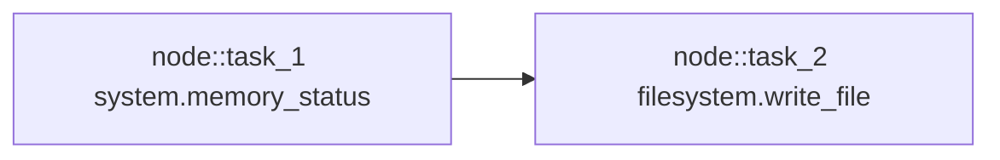

# Worked Example: Memory Report And File Save

This document follows one real prompt through the current runtime.

We use this prompt:

```text
how much free memory do i have on this system? and save the report to file named report.txt
```

This is a good example because it includes:

- a read-only system inspection task
- a mutating file-write task
- a confirmation pause
- gateway-backed execution
- final rendering


## Step 1: Prompt Intake

The OpenAI-compatible chat endpoint extracts the latest user prompt from the
message list and passes it into:

- `AgentRuntime.handle_request(...)`

The runtime context usually includes:

- `workspace_root`
- `confirmation`
- observability callback information


## Step 2: Prompt Classification

The runtime asks the LLM to classify the prompt.

At a high level, the classifier decides:

- this is a tool-using request
- the likely domain is system-oriented
- clarification is not needed

The runtime validates that classification and keeps going.


## Step 3: Task Decomposition

The prompt becomes two tasks:

1. read the system memory report
2. save that report to `report.txt`

That matters because the runtime can now reason about:

- a read task
- a write task
- a dependency from task 2 to task 1


## Step 4: Verb And Object Assignment

The runtime asks for semantic typing, but the LLM is constrained to choose from
known runtime object families.

The important result is usually close to:

- task 1: `read` over `system.memory`
- task 2: `create` over `filesystem.file`

This is one of the places where the runtime avoids free-form drift.


## Step 5: Capability Selection

### Task 1

The runtime builds a shortlist of real registered capabilities and asks the LLM
to judge them.

The expected winner is:

- `system.memory_status`

### Task 2

The runtime builds a shortlist for the save task.

The expected winner is:

- `filesystem.write_file`

Because selection is shortlist-based, the LLM does not invent new capability
ids here.


## Step 6: Capability Fit

Now each selected capability is checked again with a stronger fit step.

### Why `system.memory_status` fits

- semantic verb matches `read`
- object family matches `system.memory`
- manifest is read-only and low risk

### Why `filesystem.write_file` fits

- semantic verb matches `create`
- object family matches `filesystem.file`
- manifest supports writing content or `input_ref`
- mutation is allowed only with confirmation

If one of these had failed, the runtime would surface a capability gap instead
of pretending the task was supported.


## Step 7: Dataflow Planning

The runtime now asks whether task 2 should consume the output of task 1.

The accepted ref should look conceptually like:

- producer: task 1 output
- consumer: task 2 `input_ref`

This is the important handoff that lets the write task serialize the actual
memory report instead of inventing new content.


## Step 8: Argument Extraction

The runtime fills arguments for both tasks.

### Task 1

Usually:

- `human_readable = true`

### Task 2

Usually:

- `path = report.txt`
- `format = text`
- `input_ref = <task_1 output ref>`
- `overwrite = false`

The `format` can also be inferred from the filename extension when appropriate.


## Step 9: DAG Construction

The trusted DAG now contains two nodes:

1. node for `system.memory_status`
2. node for `filesystem.write_file`

And it contains a dependency edge from the write node back to the memory node.




## Step 10: Safety Evaluation

The runtime inspects the DAG before execution.

Task 1 is straightforward:

- safe
- read-only
- no confirmation needed

Task 2 changes state:

- writes to disk
- mutates the workspace
- therefore requires confirmation

At this point the runtime does **not** execute the DAG yet.


## Step 11: Confirmation Pause

Instead of pretending execution failed, the runtime returns a special pause
state:

- `confirmation_required`

The API layer stores the trusted planning trace and returns a message like:

```text
Confirmation required. Reply with approve to continue or cancel to stop.
```

The user can then say:

- `approve`
- or `cancel`


## Step 12: Approval Replay

If the user says `approve`, the API layer replays the already-validated plan
with:

- `confirmation = true`

The system does **not** re-ask the user’s original semantic question from
scratch. It resumes the trusted plan.


## Step 13: Execution

Now the two DAG nodes run.

### Node 1

`system.memory_status` runs through the gateway and returns structured memory
data.

### Node 2

`filesystem.write_file` runs through the gateway and writes the serialized
memory report inside the workspace.

The write result includes both:

- `path` — workspace-relative, such as `report.txt`
- `absolute_path` — full resolved path, such as
  `/home/vraj/Desktop/workspace/openfabric/report.txt`


## Step 14: Output Planning And Rendering

The output pipeline normalizes the results into typed result shapes.

For this flow, the user-facing answer typically includes:

- the memory report table
- a saved-file confirmation message

The saved-file renderer prefers the full `absolute_path` when available, so the
assistant can show the exact file location rather than only `report.txt`.

If LLM display planning fails, deterministic fallback rendering still produces a
truthful answer from the normalized result shapes.


## What This Example Teaches

This one prompt shows the whole design in miniature:

- the LLM helps understand the request
- the runtime constrains and validates that understanding
- safety gates mutating actions behind confirmation
- the gateway performs the real environment work
- the output pipeline renders a clean final answer

That is the system in motion.
