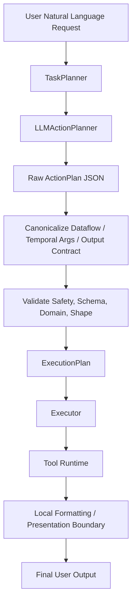

# Runtime Architecture

This document is a concise architecture map. For the complete current-state design and data-flow narrative, see [System Design](./SYSTEM_DESIGN.md).

## Overview

OpenFabric / AOR is a validator-enforced LLM action-planning runtime for local and gateway-routed execution. The current architecture is centered on `ExecutionEngine`, `TaskPlanner`, `LLMActionPlanner`, deterministic validators, tool execution, local formatting, and final shaping through `runtime.return`.

The important top-level rule is:

- use the LLM action planner for every natural-language request
- never route through legacy direct, hierarchical, raw `ExecutionPlan`, or deterministic classifier planner paths
- treat `runtime.return` plus `OutputContract` as the final deterministic output boundary

Capability-pack and typed-intent modules remain in the repository as helper libraries, fixtures, and compatibility test surfaces. They are no longer the top-level semantic router.

## Core Design Principles

- LLM-first action planning: the model proposes structured tool actions, not raw executable sessions.
- Deterministic safety boundary: validators decide tool availability, SQL safety, shell safety, filesystem roots, SLURM read-only behavior, dataflow, and result shape.
- No legacy fallback: direct/hierarchical/raw planner modes are retired.
- Deterministic execution and shaping: tool execution, validation, dataflow, and final rendering are explicit and code-driven.
- Persisted observability: sessions, events, and snapshots are stored in SQLite and power CLI/API progress streaming.

## Top-Level Request Flow

## Current Planning Modes

The active planning mode is `validator_enforced_action_planner`.

Deprecated config flags such as `AOR_ACTION_PLANNER_ENABLED`, `AOR_LEGACY_EXECUTION_PLANNER_ENABLED`, `planner.prompt`, and `planner.decomposer_prompt` may still parse for one release, but they do not reactivate old planner routes.

## Execution Pipeline

The runtime flow from compiled plan to final user output is:

1. `ExecutionEngine` creates or resumes a session.
2. `TaskPlanner` calls `LLMActionPlanner` and compiles a validated `ExecutionPlan`.
3. `PlanExecutor` executes steps in order.
4. `runtime/dataflow.py` resolves `$ref` inputs between steps.
5. `RuntimeValidator` re-checks tool outputs against deterministic expectations or fixture-backed truth.
6. `summarize_final_output()` and `runtime.return` shape the final response.
7. The engine persists updated session state, events, and snapshots.

Important engine events include:

- `session.created`
- `planner.started`
- `planner.completed`
- `executor.step.started`
- `executor.step.output`
- `executor.step.completed`
- `validator.started`
- `validator.completed`
- `finalize.completed`

## Module Map

### Entry surfaces

- `src/aor_runtime/cli.py`: CLI commands, interactive chat, progress rendering, capabilities view.
- `src/aor_runtime/api/app.py`: FastAPI API, session endpoints, SSE progress streaming, OpenAI-compatible chat surface.
- `src/aor_runtime/runtime/engine.py`: orchestrates planning, execution, validation, finalization, and session persistence.

### Planning and domain helpers

- `src/aor_runtime/runtime/planner.py`: `TaskPlanner`, active planning mode tracking, and final `ExecutionPlan` validation.
- `src/aor_runtime/runtime/action_planner.py`: LLM action planning, normalization, canonicalization, and action validation.
- `src/aor_runtime/runtime/capabilities/base.py`: compatibility capability interfaces and compile context types.
- `src/aor_runtime/runtime/capabilities/registry.py`: compatibility pack ordering and direct pack dispatch for tests/tools that still call packs explicitly.
- `src/aor_runtime/runtime/intents.py`: shared typed intents and `IntentResult`.
- `src/aor_runtime/runtime/intent_classifier.py`: shared deterministic intent parsing retained for helper/compatibility surfaces.
- `src/aor_runtime/runtime/intent_compiler.py`: shared deterministic plan builders retained for helper/compatibility surfaces.
- `src/aor_runtime/runtime/capabilities/slurm.py`: domain-specific helper logic and fixtures for SLURM semantics.

### Execution and shaping

- `src/aor_runtime/runtime/executor.py`: step execution, streaming-aware tools, preview commands, final-output summarization.
- `src/aor_runtime/runtime/dataflow.py`: `$ref` resolution, default output paths, fs.write coercion.
- `src/aor_runtime/runtime/validator.py`: deterministic re-validation of tool outputs.
- `src/aor_runtime/runtime/output_contract.py`: normalization and rendering rules.
- `src/aor_runtime/tools/runtime_return.py`: internal final-output shaping tool.

### Persistence and observability

- `src/aor_runtime/runtime/sessions.py`: session creation and persistence helpers.
- `src/aor_runtime/runtime/store.py`: SQLite-backed sessions, events, and snapshots.
- `src/aor_runtime/runtime/state.py`: runtime state schema and initial metrics.

### Tools

- `src/aor_runtime/tools/factory.py`: builds the runtime tool registry.
- `src/aor_runtime/tools/filesystem.py`: filesystem primitives.
- `src/aor_runtime/tools/search_content.py`: native content-search tool.
- `src/aor_runtime/tools/sql.py`: read-only SQL execution.
- `src/aor_runtime/tools/shell.py`: gateway-backed shell execution.
- `src/aor_runtime/tools/gateway.py`: gateway transport helpers.
- `src/aor_runtime/tools/slurm.py`: read-only SLURM inspection and metrics tools.

### Evaluation

- `scripts/evaluate_exhaustive_nlp_regression.py`: global 100-case regression gate.
- `scripts/evaluate_capability_packs.py`: per-capability promotion gate runner.
- `src/aor_runtime/runtime/eval_fixtures.py`: deterministic eval workspace and fixture generation.
- `src/aor_runtime/runtime/capabilities/eval.py`: eval pack schemas and loaders.

## Capability Modules And Legacy Helpers

Capability-pack modules, typed-intent helpers, deterministic classifiers, and pack compilers remain in the repository for domain logic, fixtures, validator support, direct unit tests, and compatibility utilities. They are not the top-level natural-language routing system.

The active user-prompt path is:

1. `TaskPlanner`
2. `LLMActionPlanner`
3. action canonicalization and deterministic validation
4. `ExecutionPlan`
5. tool execution and final presentation

If compatibility code calls a capability pack directly, that path must still obey the same tool safety, output contracts, and final presentation boundaries.

## Safety Boundaries

The runtime is designed to keep unsafe planning surfaces out of the LLM whenever possible.

Current hard boundaries:

- capability compilers produce the supported deterministic plans
- `runtime.return` is the only internal tool intended to shape final user-facing output
- domain capabilities should not be expressed as raw shell planning when a dedicated pack/tool exists
- the typed LLM intent extractor must not emit:
  - raw tool calls
  - shell commands
  - gateway commands
  - SLURM command strings
  - `python.exec`
  - raw `ExecutionPlan` payloads

For SLURM specifically, only read-only inspection and metrics are supported. Mutation and admin operations are blocked by design.

## Extensibility Model

The system is extended by adding registered tools, tool output contracts, tool surface contracts, deterministic validators, presenters, and eval coverage. LLM planning may then select the new tool, but the runtime must be able to validate, execute, trace, and render it without raw payload leakage.

Compatibility capability packs may still be useful as helper libraries or test fixtures, but new user-facing behavior should be wired through the validator-enforced action-planner architecture described in [System Design](./SYSTEM_DESIGN.md).

See:

- [CAPABILITY_PACKS.md](./CAPABILITY_PACKS.md)
- [ADDING_A_CAPABILITY.md](./ADDING_A_CAPABILITY.md)
- [TOOLS_AND_RUNTIME.md](./TOOLS_AND_RUNTIME.md)
