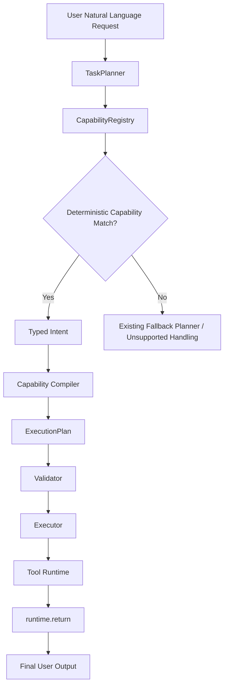

# Runtime Architecture

## Overview

OpenFabric / AOR is a deterministic-first agent runtime for local and gateway-routed execution. The current architecture is centered on `ExecutionEngine`, `TaskPlanner`, the `CapabilityRegistry`, deterministic tools, validator re-checks, and final shaping through `runtime.return`.

The important top-level rule is:

- try deterministic capability matching first
- only use the raw direct or hierarchical planner when no capability pack can safely handle the request
- treat `runtime.return` plus `OutputContract` as the final deterministic output boundary

The runtime also supports an optional typed LLM intent extractor for fuzzy SLURM inspection prompts, but that path is constrained to validated intent JSON only and is disabled by default.

## Core Design Principles

- Deterministic-first: most supported requests compile to a typed intent and a fixed `ExecutionPlan` without planner-generated tool calls.
- Typed intent planning: capability packs classify user requests into Pydantic intent models and then compile them into plans.
- Safe fallback: raw LLM planning remains available, but only after deterministic packs miss.
- Deterministic execution and shaping: tool execution, validation, dataflow, and final rendering are explicit and code-driven.
- Persisted observability: sessions, events, and snapshots are stored in SQLite and power CLI/API progress streaming.

## Top-Level Request Flow

## Current Planning Modes

The planner currently distinguishes three practical paths:

### 1. Deterministic capability-pack path

`TaskPlanner` asks `CapabilityRegistry` to classify the goal. If a pack matches, the intent is compiled to a concrete `ExecutionPlan` through that pack.

This is the normal path for supported filesystem, SQL, shell, fetch, compound, and SLURM prompts.

### 2. Optional typed LLM-intent extraction path

If deterministic classification misses and `AOR_ENABLE_LLM_INTENT_EXTRACTION=true`, packs that opt in may attempt a second-pass typed extraction. Today that is limited to SLURM.

This path is still capability-driven:

- the LLM may only emit JSON for an allowed intent schema
- the result is validated and safety-checked
- the pack compiler still produces the plan

The LLM does not get to emit tool calls, shell commands, gateway commands, `python.exec`, or an `ExecutionPlan`.

### 3. Raw planner fallback

If capability matching and optional typed intent extraction both miss, `TaskPlanner` falls back to the existing direct or hierarchical planner flow.

This fallback is still guarded by:

- planner policies
- plan canonicalization
- contract validation
- executor and validator re-checks

## Execution Pipeline

The runtime flow from compiled plan to final user output is:

1. `ExecutionEngine` creates or resumes a session.
2. `TaskPlanner` builds an `ExecutionPlan`.
3. `PlanExecutor` executes steps in order.
4. `runtime/dataflow.py` resolves `$ref` inputs between steps.
5. `RuntimeValidator` re-checks tool outputs against deterministic expectations or fixture-backed truth.
6. `summarize_final_output()` and `runtime.return` shape the final response.
7. The engine persists updated session state, events, and snapshots.

Important engine events include:

- `session.created`
- `planner.started`
- `planner.completed`
- `executor.step.started`
- `executor.step.output`
- `executor.step.completed`
- `validator.started`
- `validator.completed`
- `finalize.completed`

## Module Map

### Entry surfaces

- `src/aor_runtime/cli.py`: CLI commands, interactive chat, progress rendering, capabilities view.
- `src/aor_runtime/api/app.py`: FastAPI API, session endpoints, SSE progress streaming, OpenAI-compatible chat surface.
- `src/aor_runtime/runtime/engine.py`: orchestrates planning, execution, validation, finalization, and session persistence.

### Planning and capabilities

- `src/aor_runtime/runtime/planner.py`: `TaskPlanner`, planner mode tracking, deterministic-first routing, raw planner fallback.
- `src/aor_runtime/runtime/capabilities/base.py`: capability interfaces and compile context types.
- `src/aor_runtime/runtime/capabilities/registry.py`: pack ordering, classification, and compilation dispatch.
- `src/aor_runtime/runtime/intents.py`: shared typed intents and `IntentResult`.
- `src/aor_runtime/runtime/intent_classifier.py`: shared deterministic intent parsing used by several packs.
- `src/aor_runtime/runtime/intent_compiler.py`: shared deterministic plan builder used by several packs.
- `src/aor_runtime/runtime/capabilities/slurm.py`: domain-specific pack-local classifier/compiler and optional typed LLM intent path.

### Execution and shaping

- `src/aor_runtime/runtime/executor.py`: step execution, streaming-aware tools, preview commands, final-output summarization.
- `src/aor_runtime/runtime/dataflow.py`: `$ref` resolution, default output paths, fs.write coercion.
- `src/aor_runtime/runtime/validator.py`: deterministic re-validation of tool outputs.
- `src/aor_runtime/runtime/output_contract.py`: normalization and rendering rules.
- `src/aor_runtime/tools/runtime_return.py`: internal final-output shaping tool.

### Persistence and observability

- `src/aor_runtime/runtime/sessions.py`: session creation and persistence helpers.
- `src/aor_runtime/runtime/store.py`: SQLite-backed sessions, events, and snapshots.
- `src/aor_runtime/runtime/state.py`: runtime state schema and initial metrics.

### Tools

- `src/aor_runtime/tools/factory.py`: builds the runtime tool registry.
- `src/aor_runtime/tools/filesystem.py`: filesystem primitives.
- `src/aor_runtime/tools/search_content.py`: native content-search tool.
- `src/aor_runtime/tools/sql.py`: read-only SQL execution.
- `src/aor_runtime/tools/shell.py`: gateway-backed shell execution.
- `src/aor_runtime/tools/gateway.py`: gateway transport helpers.
- `src/aor_runtime/tools/slurm.py`: read-only SLURM inspection and metrics tools.

### Evaluation

- `scripts/evaluate_exhaustive_nlp_regression.py`: global 100-case regression gate.
- `scripts/evaluate_capability_packs.py`: per-capability promotion gate runner.
- `src/aor_runtime/runtime/eval_fixtures.py`: deterministic eval workspace and fixture generation.
- `src/aor_runtime/runtime/capabilities/eval.py`: eval pack schemas and loaders.

## Shared Infrastructure vs Pack-Local Logic

Not every capability pack is fully pack-local today.

Current patterns:

- Shared deterministic infrastructure:
  - `FilesystemCapabilityPack`
  - `SqlCapabilityPack`
  - `ShellCapabilityPack`
  - `FetchCapabilityPack`
  - `CompoundCapabilityPack`
  - these wrap `intent_classifier.py` and `intent_compiler.py`
- Pack-local logic:
  - `SlurmCapabilityPack`
  - this defines its own intent types, classifier, compiler, safety rules, and optional typed LLM intent extraction path

This means the capability-pack architecture is the active top-level routing model, while the older shared classifier/compiler modules remain active supporting infrastructure for several packs.

## Safety Boundaries

The runtime is designed to keep unsafe planning surfaces out of the LLM whenever possible.

Current hard boundaries:

- capability compilers produce the supported deterministic plans
- `runtime.return` is the only internal tool intended to shape final user-facing output
- domain capabilities should not be expressed as raw shell planning when a dedicated pack/tool exists
- the typed LLM intent extractor must not emit:
  - raw tool calls
  - shell commands
  - gateway commands
  - SLURM command strings
  - `python.exec`
  - raw `ExecutionPlan` payloads

For SLURM specifically, only read-only inspection and metrics are supported. Mutation and admin operations are blocked by design.

## Extensibility Model

The system is extended in three layers:

1. Add or reuse typed intents
2. Add or update a capability pack
3. Add or reuse tool implementations and output shaping

In practice:

- if a new feature fits the existing shared intent model, a thin capability pack wrapper is often enough
- if a new domain needs custom classification, safety rules, or output compilation, implement a pack-local capability like SLURM
- every new capability should also get tests and a checked-in eval pack

See:

- [CAPABILITY_PACKS.md](./CAPABILITY_PACKS.md)
- [ADDING_A_CAPABILITY.md](./ADDING_A_CAPABILITY.md)
- [TOOLS_AND_RUNTIME.md](./TOOLS_AND_RUNTIME.md)
