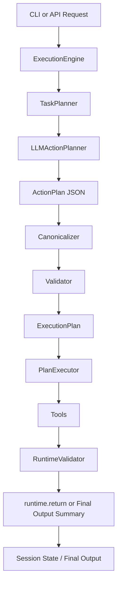
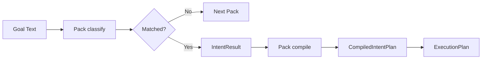
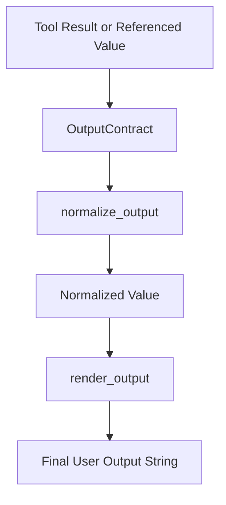
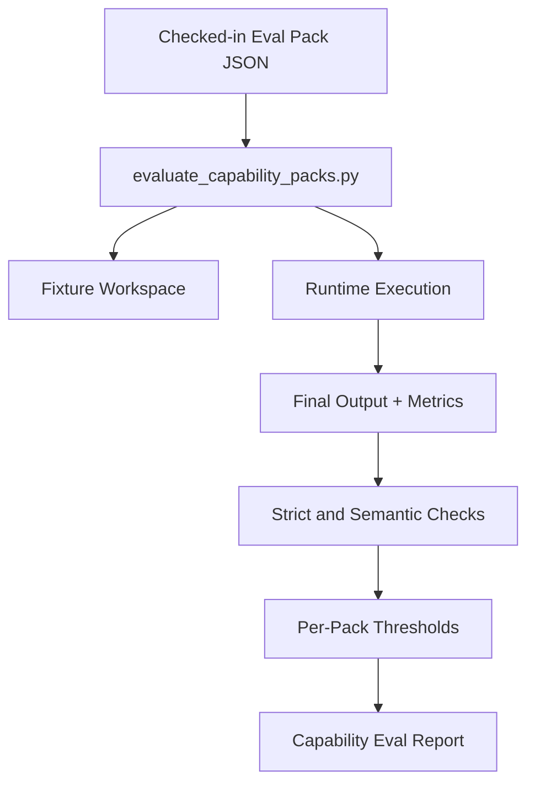
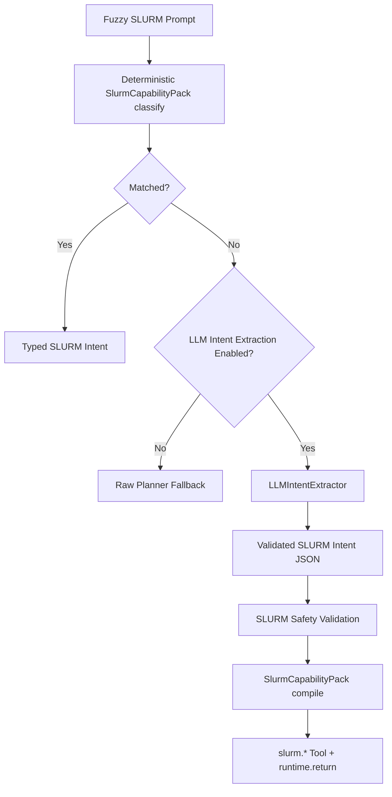

# Mermaid Diagrams

## End-to-End Request Flow

## Capability-Pack Lifecycle

Capability packs are retained for compatibility helpers and tests. They are
not the default natural-language planning route.

## `runtime.return` and Output Shaping

## Evaluation Flow

## SLURM Fuzzy Prompt to Typed Intent

