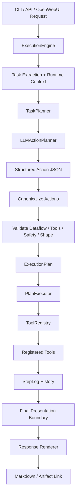
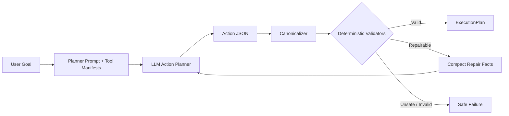
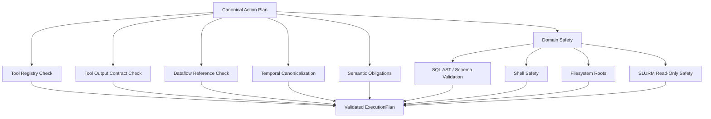
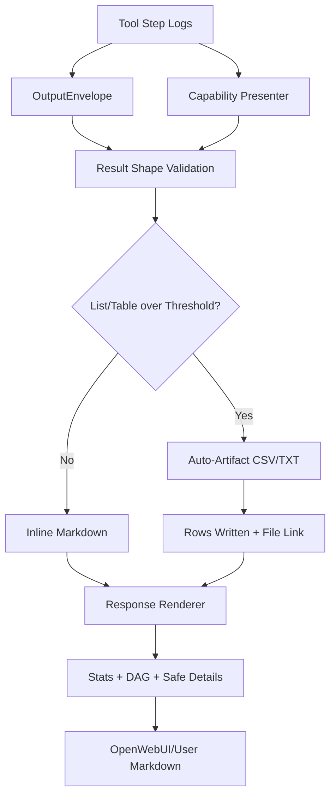
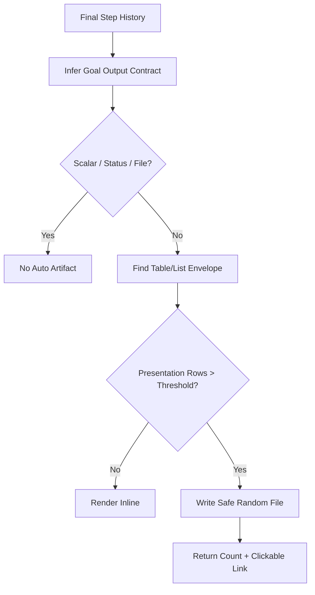
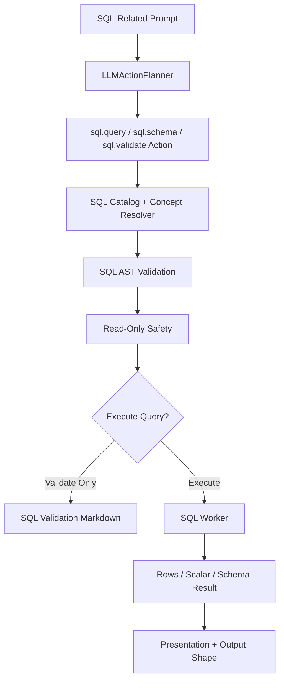
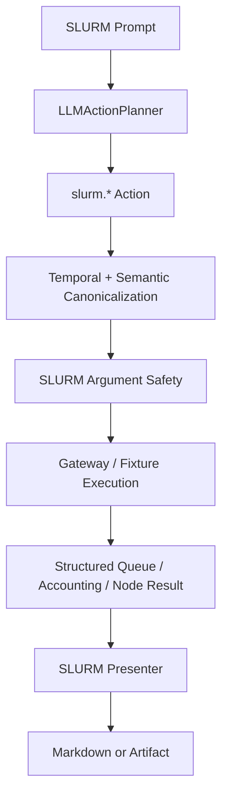
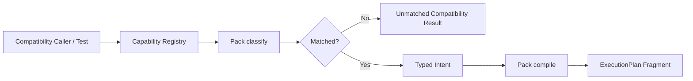
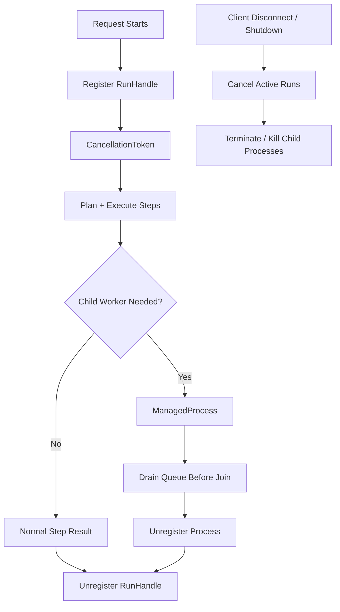

# Mermaid Diagrams

These diagrams reflect the current OpenFABRIC architecture. For the full design narrative, see [System Design](./SYSTEM_DESIGN.md).

## End-To-End Request Flow

## LLM Planning Boundary

The LLM proposes structured actions. It does not get authority to bypass validators, execute raw commands, ignore dataflow contracts, or format raw result payloads for final output.

## Deterministic Validation Boundary

## Final Output Boundary

User mode never displays raw JSON. Large list/table outputs are artifacted by display-row count, while scalar and grouped-count prompts validate the structured primary result instead of counting numbers in rendered Markdown.

## Auto-Artifact Decision Path

## SQL Request Path

## SLURM Request Path

SLURM prompts use native read-only `slurm.*` tools. They are not translated into arbitrary shell commands.

## Compatibility Capability-Pack Flow

Capability packs remain for helper code, fixtures, evals, and compatibility tests. They are not the default natural-language request path.

## Worker Lifecycle

