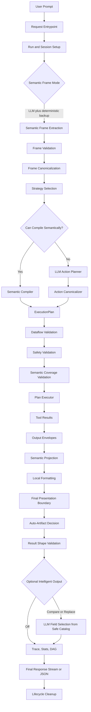
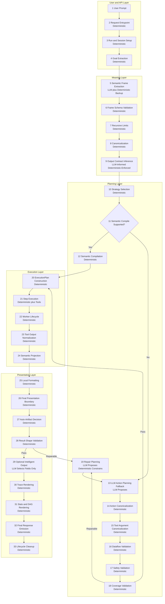
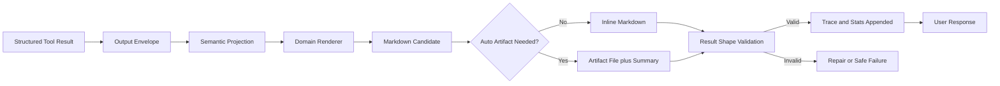

# Prompt Lifecycle README

This document explains the current OpenFABRIC prompt lifecycle from user input to final response. It focuses on the operational path a prompt travels through, the component responsible for each stage, and whether that stage is handled by the LLM, deterministic runtime code, or both.

`docs/SYSTEM_DESIGN.md` remains the canonical architecture document. This README is the step-by-step companion for prompt flow review, debugging, and architectural evaluation.

## Ownership Model

OpenFABRIC uses the LLM for semantic interpretation and repair proposals, but not for unchecked execution. The runtime owns every safety, schema, output, lifecycle, and presentation boundary.

| Owner | What It Does | What It Must Not Do |
| --- | --- | --- |
| LLM | Extract semantic meaning, propose structured action plans, propose repair plans, optionally select display fields from safe field catalogs. | Execute tools, emit unchecked shell commands, receive raw rows/PHI, receive SLURM job payloads, bypass validators. |
| Deterministic runtime | Canonicalize, validate, repair, compile, execute, normalize, project, render, artifact, and enforce result shape. | Trust LLM output without schema/safety checks. |
| Tools | Perform bounded domain work through typed arguments and typed results. | Decide user intent or shape final user-facing output directly. |

## High-Level Mermaid

## Stage-by-Stage Prompt Path

### 1. Request Entrypoint

Owner: deterministic runtime

Primary components:

- `src/aor_runtime/api/app.py`
- CLI command handlers
- OpenAI-compatible `/v1/chat/completions`
- OpenWebUI streaming paths

What happens:

- The user prompt is extracted from chat messages or CLI input.
- Runtime configuration is loaded.
- Model, temperature, streaming mode, trace mode, and response mode are resolved.
- The runtime determines whether this is a chat-style request, run/session request, or internal execution request.

Output:

- A normalized request payload ready for engine/session handling.

### 2. Run and Session Setup

Owner: deterministic runtime

Primary components:

- `ExecutionEngine`
- run store/session state
- lifecycle registry
- cancellation tokens

What happens:

- A run or session is created or resumed.
- A run handle is registered.
- Cancellation state is attached.
- Stats and trace containers are initialized.
- The runtime records timing, backend metadata, and planned event streams.

Output:

- A tracked run context with lifecycle and cancellation support.

### 3. User Goal Extraction

Owner: deterministic runtime

Primary components:

- request parser
- engine session payload extraction
- chat message normalizer

What happens:

- The runtime extracts the current user goal from the request.
- Prior conversation context may be kept as message context, but the active goal is normalized into a single planning target.
- Empty or malformed goals are rejected before planning.

Output:

- `goal: str`

### 4. Semantic Frame Extraction

Owner: LLM plus deterministic backup

Primary components:

- `LLMSemanticFrameExtractor`
- `deterministic_semantic_frame(...)`
- `SemanticFrame`

What happens:

- The LLM may extract a typed semantic frame containing:
  - domain
  - intent
  - entity
  - metrics
  - filters
  - targets
  - dimensions
  - time window
  - output contract
  - child frames for true compound tasks
- Deterministic backup rules recognize known safe patterns.

Examples:

- `average time for slicer and totalseg partitions` becomes a SLURM aggregate frame with partition targets.
- `count patients, studies, series, RTPLANS in dicom` becomes a SQL/DICOM multi-scalar table frame.
- `count CSV and JSON files` becomes a filesystem count frame with extension targets.

LLM boundary:

- The LLM extracts meaning only.
- It must not emit SQL, shell commands, tool names, executable plans, raw rows, file contents, stdout/stderr, SLURM job payloads, or PHI.

Output:

- `SemanticFrameExtractionResult`

### 5. Semantic Frame Schema Validation

Owner: deterministic runtime

Primary components:

- Pydantic `SemanticFrame` models
- executable-payload rejection logic

What happens:

- The extracted frame is validated against the typed schema.
- Unknown fields are rejected.
- Executable payloads are rejected.
- Invalid domains, intents, output shapes, and malformed child frames are rejected.

Output:

- A schema-valid semantic frame or a safe planning failure.

### 6. Recursive Frame Limits

Owner: deterministic runtime

Primary components:

- `SemanticFrameCanonicalizer`
- semantic-frame settings

What happens:

- True compound tasks may become child frames.
- Same-operation multi-target requests stay as target sets, not child frames.
- Recursion depth is capped by `AOR_SEMANTIC_FRAME_MAX_DEPTH`.
- Child count is capped by `AOR_SEMANTIC_FRAME_MAX_CHILDREN`.

Examples:

- `summarize files, then show SQL capabilities` can become child frames.
- `slicer and totalseg partitions` stays one frame with `targets.partition`.

Output:

- A bounded semantic-frame tree.

### 7. Semantic Canonicalization

Owner: deterministic runtime

Primary components:

- `SemanticFrameCanonicalizer`
- domain canonicalization helpers
- temporal normalization

What happens:

- Synonyms are normalized.
- Typos are handled where deterministic rules exist.
- Metrics are canonicalized.
- Targets are cleaned and ordered.
- Filters are normalized.
- Dates and time windows are normalized.
- Output shape is corrected when the prompt implies a different contract than the LLM produced.

Examples:

- `avg`, `average time`, `job times` -> `average_elapsed`
- `past 7 days`, `last 7 days` -> normalized time window
- `all jobs` for SLURM accounting -> all job states
- `patients, studies, series, RTPLANS` -> table/dashboard output, not scalar

Output:

- Canonical `SemanticFrame`

### 8. Output Contract Inference

Owner: deterministic runtime, informed by LLM semantic frame

Primary components:

- `output_shape.py`
- `SemanticOutputContract`
- result-shape helpers

What happens:

- The runtime determines whether the final answer should be:
  - scalar
  - table
  - grouped count
  - multi-scalar dashboard/table
  - file
  - status
  - text
  - JSON only in explicit raw/export paths

Important rule:

- The LLM may suggest output shape, but the runtime enforces and corrects it.

Example:

- `count patients in dicom` -> scalar
- `count patients, studies, series, RTPLANS in dicom` -> table
- `count jobs by partition` -> grouped table

Output:

- `GoalOutputContract`

### 9. Semantic Strategy Selection

Owner: deterministic runtime

Primary components:

- semantic strategy selector
- domain capability metadata

What happens:

- The runtime chooses the safest execution strategy:
  1. grouped pushdown
  2. multi-target pushdown
  3. bounded fan-out
  4. broad safe fetch plus local projection when declared safe
  5. fallback to LLM action planning

Examples:

- SLURM multi-partition runtime aggregate prefers grouped accounting by partition.
- DICOM multi-entity counts prefer one aggregate SQL query.
- Filesystem multi-extension count can use grouped extension aggregation.

Output:

- A selected semantic strategy or fallback decision.

### 10. Semantic Compilation

Owner: deterministic runtime

Primary components:

- `SemanticFrameCompiler`
- domain compilers under `runtime/semantic/compilers`
- schema-grounded SQL builders
- SLURM compiler
- filesystem/shell/diagnostic compilers

What happens:

- If the semantic frame is supported, it is compiled directly into an `ExecutionPlan`.
- This can skip LLM action planning.
- Plans use typed tools and validated argument shapes.

Examples:

- SLURM aggregate -> `slurm.accounting_aggregate -> text.format -> runtime.return`
- DICOM multi-count -> `sql.query -> text.format -> runtime.return`
- Docker inspection -> `shell.exec -> text.format -> runtime.return` if shell planning reaches that path and safety allows it

Output:

- `SemanticCompilationResult`

### 11. LLM Action Planning Fallback

Owner: LLM proposes, deterministic runtime validates

Primary components:

- `LLMActionPlanner`
- action planner prompt
- `ActionPlan`

What happens:

- If semantic compilation cannot safely handle the frame, the LLM proposes structured actions.
- The LLM returns JSON action plans, not direct execution.
- The action plan may contain tool names, inputs, dependencies, output bindings, and expected final shape.

Boundary:

- The proposed plan is not trusted.
- It is only a candidate.

Output:

- Candidate `ActionPlan`

### 12. Action Canonicalization

Owner: deterministic runtime

Primary components:

- `ActionPlanCanonicalizer`
- temporal canonicalizer
- semantic obligation repair
- SQL repair helpers
- data reference rewrite helpers

What happens:

- Tool names are normalized.
- Action IDs are normalized.
- Inputs are normalized.
- Database names are propagated.
- Time arguments are normalized.
- Bare references are rewritten.
- Known planner drift is repaired.

Examples:

- LLM emits multiple DICOM count queries for a multi-scalar prompt -> runtime repairs to one aggregate query.
- LLM emits grouped modality rows for a scalar RTPLAN prompt -> runtime repairs to scalar aggregate.
- LLM misses `group_by=partition` for a grouped SLURM count -> runtime adds it.

Output:

- Canonical action plan candidate.

### 13. Tool Argument Canonicalization

Owner: deterministic runtime

Primary components:

- `ToolArgumentCanonicalizer`
- tool schema metadata

What happens:

- Tool arguments are scrubbed and shaped before validation.
- Runtime-only metadata is removed from tool args.
- Internal semantic metadata stays on execution-step metadata.

Example:

- `semantic_projection` belongs in step metadata, not inside `slurm.accounting_aggregate` args.

Output:

- Tool-schema-compatible arguments.

### 14. Dataflow and Reference Validation

Owner: deterministic runtime

Primary components:

- `dataflow.py`
- `tool_output_contracts.py`
- `PlanDataflowValidator`

What happens:

- `$ref` values are checked against producer output contracts.
- Default paths are applied when safe.
- Invalid paths are rejected before execution.

Examples:

- `sql.query` default formatter path is `rows`.
- `text.format` return path is `content`.
- Collection paths cannot satisfy scalar prompts unless the output contract says table/list.

Output:

- Dataflow-valid `ExecutionPlan`

### 15. Domain Safety Validation

Owner: deterministic runtime

Primary components:

- SQL safety and AST validation
- shell safety
- filesystem path validation
- SLURM read-only validation
- runtime validator

What happens:

- SQL must be read-only, schema-grounded, alias-scoped, and correctly quoted.
- Shell commands must be read-only and allowlisted by subcommand policy.
- Filesystem paths must stay inside allowed roots.
- SLURM operations must be read-only.
- Unknown tools and unknown actions are rejected.

Examples:

- `docker ps` is read-only.
- `docker run` is blocked.
- `SELECT COUNT(*) ...` is allowed.
- `DELETE FROM ...` is blocked.

Output:

- Safety-approved plan or safe failure.

### 16. Semantic Coverage Validation

Owner: deterministic runtime

Primary components:

- `SemanticCoverageValidator`
- semantic frame metadata

What happens:

- The runtime checks whether the candidate plan actually satisfies the semantic frame.
- Safe but wrong plans are rejected.

Examples:

- `slurm.queue` cannot satisfy `average_elapsed`.
- Raw job listings cannot satisfy aggregate runtime.
- SQL table rows cannot satisfy scalar count unless the result is a valid scalar result.

Output:

- Coverage-approved plan or repair facts.

### 17. Repair Planning

Owner: LLM proposes, deterministic runtime constrains

Primary components:

- `LLMActionPlanner` repair loop
- compact failure context
- deterministic repair helpers

What happens:

- If validation fails, the runtime may ask the LLM to replan with compact facts.
- Raw rows, PHI, job payloads, stdout/stderr, and file contents are not sent.
- Deterministic repairs may run before or after LLM repair attempts.

Output:

- Repaired candidate plan or terminal safe failure.

### 18. Execution Plan Construction

Owner: deterministic runtime

Primary components:

- `ExecutionPlan`
- `ExecutionStep`

What happens:

- The final plan is converted into ordered execution steps.
- Each step has:
  - action/tool
  - args
  - input dependencies
  - output alias
  - metadata

Output:

- Final executable `ExecutionPlan`

### 19. Step Execution

Owner: deterministic runtime plus tools

Primary components:

- `PlanExecutor`
- `ToolRegistry`
- registered tool implementations

What happens:

- Steps run in dependency order.
- Tool inputs are resolved from prior outputs.
- Each tool returns structured results.

Tool domains:

- `sql.query`, `sql.schema`, `sql.validate`
- `slurm.queue`, `slurm.accounting`, `slurm.accounting_aggregate`, and other SLURM tools
- `fs.*`
- `shell.exec`
- `text.format`
- `runtime.return`
- Python/internal tools where allowed

Output:

- Step logs and tool results.

### 20. Worker Lifecycle and Cancellation

Owner: deterministic runtime

Primary components:

- run handles
- cancellation tokens
- managed worker processes
- shutdown cleanup

What happens:

- Long-running SQL/Python work uses managed subprocesses.
- Queues are drained safely.
- Timeouts cancel workers.
- Server shutdown cancels active runs.
- Child processes are terminated so they do not hold listening sockets.

Output:

- Completed, failed, or cancelled step state.

### 21. Tool Output Normalization

Owner: deterministic runtime

Primary components:

- `output_envelope.py`
- tool-specific normalizers
- SLURM result normalizer
- SQL row/result handling

What happens:

- Raw tool outputs become normalized envelopes.
- Shell tables may be parsed.
- SQL rows are shaped.
- SLURM accounting results are normalized into runtime summaries.
- Scalars, rows, grouped values, files, warnings, and truncation metadata are separated.

Output:

- Normalized tool outputs.

### 22. Semantic Result Projection

Owner: deterministic runtime

Primary components:

- semantic projection helpers
- step metadata

What happens:

- The runtime applies semantic constraints to structured results after execution.
- Requested target groups are retained.
- Group order follows user target order.
- Source truncation and projection metadata are preserved separately.

Examples:

- A grouped SLURM aggregate over all partitions can be projected to `totalseg` and `slicer`.
- A multi-target count can be displayed in the user-requested order.

Output:

- Projected structured result.

### 23. Local Formatting

Owner: deterministic runtime

Primary components:

- `text.format`
- local formatter

What happens:

- Structured results are converted into Markdown, text, CSV, or other allowed formats.
- This happens locally.
- Raw tool payloads are not directly exposed.

Output:

- Formatted content, usually Markdown for chat.

### 24. Final Presentation Boundary

Owner: deterministic runtime

Primary components:

- response renderer
- presentation layer
- final presentation boundary

What happens:

- Structured final values are rendered into user-facing Markdown.
- Domain renderers take precedence over generic dict rendering.
- SQL, SLURM, filesystem, shell, and generic outputs get deterministic presentations.

Important rule:

- Raw JSON in normal user mode is invalid unless explicitly requested through a raw/debug/export path.

Output:

- User-visible Markdown body.

### 25. Auto-Artifact Decision

Owner: deterministic runtime

Primary components:

- `auto_artifact.py`
- artifact writers

What happens:

- Large rows/lists are written to local artifacts instead of fully displayed.
- UI display stays capped.
- Full exports can still be written to file where allowed.

PHI boundary:

- Runtime artifact folders are ignored by Git.
- Reports/evals must store only safe summaries, hashes, and compact failure excerpts.

Output:

- Inline answer, artifact link/summary, or both.

### 26. Result Shape Validation

Owner: deterministic runtime

Primary components:

- `result_shape.py`
- `output_shape.py`
- final output contract validation

What happens:

- The runtime validates the final structured result against the output contract.
- Scalar validation uses primary structured results, not trace/stats Markdown.
- Table validation allows multi-row or multi-column outputs.
- Multi-scalar dashboard counts are table-shaped.
- Raw JSON, unresolved refs, raw shell tables, and collection leakage are rejected in user mode.

Examples:

- `count patients in dicom` must produce one numeric scalar.
- `count patients, studies, series, RTPLANS in dicom` must produce a table/dashboard.
- `list all patients` must not be collapsed into a scalar count.

Output:

- Pass, repairable failure, or terminal safe failure.

### 27. Optional Intelligent Output Selection

Owner: optional LLM for field selection, deterministic runtime for values

Primary components:

- intelligent output planner
- display field catalog

What happens:

- If enabled, the LLM receives only safe field metadata.
- It chooses fields, title, layout, and rationale.
- It never receives raw rows, PHI, SLURM job payloads, stdout/stderr, or file contents.
- Runtime validates chosen fields and fills values locally.

Modes:

- `off`
- `compare`
- `replace`

Output:

- Optional `Intelligent Output` section or replacement rendering.

### 28. Trace Rendering

Owner: deterministic runtime

Primary components:

- OpenWebUI trace renderer
- progress events

What happens:

- The runtime renders compact progress lines.
- Trace can show planning, running, formatting, checking, and repair summaries.
- Raw payloads are not shown.

Output:

- Compact trace block for UI.

### 29. Stats and DAG Rendering

Owner: deterministic runtime

Primary components:

- stats renderer
- DAG renderer
- execution history

What happens:

- The runtime displays:
  - backend
  - tools used
  - status
  - time taken
  - LLM passes
  - token counts
  - DAG steps

Important rule:

- Stats and DAG numbers must not participate in scalar correctness validation.

Output:

- User-visible stats and DAG sections.

### 30. Final Response Emission

Owner: deterministic runtime

Primary components:

- FastAPI response path
- OpenAI-compatible response adapter
- streaming response generator

What happens:

- The final Markdown is emitted as a normal or streaming response.
- Successful streams emit the expected completion markers.
- Failed runs return safe error content, not internals.

Output:

- Final user response.

### 31. Lifecycle Cleanup

Owner: deterministic runtime

Primary components:

- active run registry
- cancellation cleanup
- managed process cleanup

What happens:

- The run handle is unregistered.
- Background tasks are completed or cancelled.
- Child processes are cleaned up.
- Shutdown waits for a bounded grace period.

Output:

- Clean runtime state after request completion.

## Compact Ownership Table

| Stage | Name | Owner |
| --- | --- | --- |
| 1 | Request entrypoint | Deterministic |
| 2 | Run/session setup | Deterministic |
| 3 | User goal extraction | Deterministic |
| 4 | Semantic frame extraction | LLM plus deterministic backup |
| 5 | Frame schema validation | Deterministic |
| 6 | Recursive frame limits | Deterministic |
| 7 | Semantic canonicalization | Deterministic |
| 8 | Output contract inference | LLM-informed, deterministic-enforced |
| 9 | Strategy selection | Deterministic |
| 10 | Semantic compilation | Deterministic |
| 11 | LLM action planning fallback | LLM proposes, deterministic validates |
| 12 | Action canonicalization | Deterministic |
| 13 | Tool argument canonicalization | Deterministic |
| 14 | Dataflow validation | Deterministic |
| 15 | Domain safety validation | Deterministic |
| 16 | Semantic coverage validation | Deterministic |
| 17 | Repair planning | LLM proposes, deterministic constrains |
| 18 | Execution plan construction | Deterministic |
| 19 | Step execution | Deterministic plus tools |
| 20 | Worker lifecycle | Deterministic |
| 21 | Tool output normalization | Deterministic |
| 22 | Semantic result projection | Deterministic |
| 23 | Local formatting | Deterministic |
| 24 | Final presentation boundary | Deterministic |
| 25 | Auto-artifact decision | Deterministic |
| 26 | Result shape validation | Deterministic |
| 27 | Intelligent output selection | Optional LLM field selection, deterministic values |
| 28 | Trace rendering | Deterministic |
| 29 | Stats and DAG rendering | Deterministic |
| 30 | Final response emission | Deterministic |
| 31 | Lifecycle cleanup | Deterministic |

## Detailed Mermaid With Ownership

## Final Output Boundary Mermaid

## Where The LLM Is Used

The LLM participates in four places:

1. Semantic-frame extraction.
2. Action-plan proposal when deterministic semantic compilation is not enough.
3. Repair-plan proposal after compact validation failures.
4. Optional intelligent output field selection from safe field catalogs.

The LLM does not own:

- SQL safety
- shell safety
- filesystem path safety
- SLURM mutation refusal
- tool schema validation
- dataflow validity
- result shape validity
- final value rendering
- artifact behavior
- lifecycle cleanup

## Why Deterministic Contracts Still Matter

The LLM can correctly infer intent and still be blocked by a bad deterministic contract. Recent examples:

- `count jobs in each partition` should be grouped/table, not scalar.
- `count patients, studies, series, RTPLANS` should be multi-scalar/table, not scalar.
- `average runtime for slicer and totalseg` should be target-set aggregate, not raw queue listing.

These failures are not solved by trusting the LLM more. They are solved by making deterministic contracts accurately model the valid shapes the LLM may propose.

## Debugging Checklist By Stage

When a prompt fails, locate the failing stage first:

1. If the wrong domain is selected, inspect semantic-frame extraction and canonicalization.
2. If the right intent is selected but wrong tool runs, inspect strategy selection and coverage validation.
3. If the LLM emits a reasonable plan but it is rejected, inspect output contract and action-plan validation.
4. If a tool rejects args, inspect tool argument canonicalization and internal metadata boundaries.
5. If SQL reaches PostgreSQL with unknown columns, inspect SQL AST validation and schema grounding.
6. If output is raw JSON or ugly generic dicts, inspect final presentation boundary.
7. If scalar prompts fail despite correct tool output, inspect structured primary-result validation.
8. If shutdown hangs, inspect worker lifecycle and active run cleanup.
