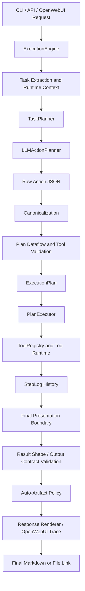
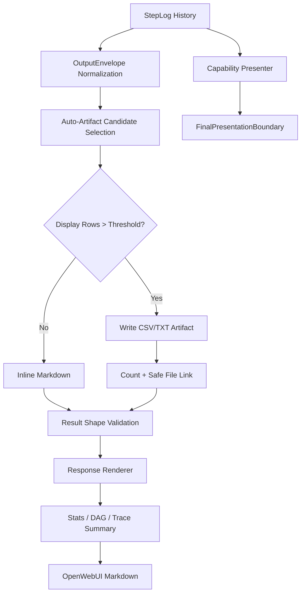

# OpenFABRIC System Design

This document is the canonical current-state design reference for OpenFABRIC / AOR. Other architecture and capability documents describe specific subsystems, but this file explains the full request path, the LLM boundary, deterministic validation, tool execution, final rendering, and safety model.

## System Purpose

OpenFABRIC turns natural-language operational prompts into validated, read-oriented tool execution plans. The LLM is used to propose structured actions; deterministic runtime layers decide whether those actions are safe, well-typed, schema-valid, correctly wired, executable, and presentable.

The core design rule is:

- the LLM proposes intent and action DAGs
- the runtime canonicalizes, validates, executes, and renders
- user-mode output is deterministic Markdown or a safe artifact link, never raw tool payloads

## Entry Points

Requests enter through three user-facing surfaces:

- CLI: `aor run`, `aor chat`, and `aor serve`
- FastAPI: run/session endpoints and event streams
- OpenAI-compatible chat: `/v1/chat/completions`, used by OpenWebUI

All natural-language requests converge on `ExecutionEngine`, which owns session state, planning, execution, validation, final presentation, and persistence.

OpenWebUI requests are reduced to the latest actionable user task. Known OpenWebUI metadata prompts are skipped so generated titles, follow-up prompts, and embedded chat history do not contaminate the current task.

## End-To-End Data Flow

The important handoffs are:

1. **Request extraction** determines the actionable prompt and runtime context.
2. **LLM planning** emits JSON actions, not raw executable sessions.
3. **Canonicalization** repairs safe planner imperfections such as missing default `$ref` paths, temporal phrases, grouped-count fields, and scalar return paths.
4. **Validation** checks domain/tool compatibility, SQL schema safety, shell safety, filesystem roots, SLURM read-only semantics, dataflow references, output shape, and semantic obligations.
5. **Execution** resolves `$ref` inputs and invokes registered tools.
6. **Presentation** turns structured results into deterministic Markdown or auto-artifacts before user-mode output leaves the runtime.

## Where The LLM Is Used

The LLM is required for:

- action planning from natural language into a structured action DAG
- bounded repair planning when deterministic validation finds a repairable issue

The LLM is optional for:

- presentation field selection in Intelligent Output compare mode
- sanitized summary generation when explicitly enabled

The LLM must not receive:

- raw SQL rows or patient lists
- PHI-bearing values
- full SLURM job payloads
- filesystem file contents unless the user explicitly requested content handling through the proper tool path
- shell stdout/stderr payloads
- credentials, environment variables, gateway internals, or raw session stores

For Intelligent Output, the LLM receives field metadata only. The runtime fills values locally after validating selected field ids.

## Deterministic Runtime Boundaries

### Tool Registry And Tool Surfaces

`ToolRegistry` is the executable source of truth for registered tools. Tool surface contracts describe labels, categories, result models, trace summaries, and presentation defaults so new tools can flow through validation, stats, traces, and rendering without bespoke plumbing.

### Dataflow And Output Contracts

Step outputs are referenced with `$ref` values. Tool output contracts define default paths, scalar paths, collection paths, text paths, and formatter-compatible paths. The plan dataflow validator canonicalizes missing or null paths and rejects invalid paths before execution with available-field context.

### Temporal Canonicalization

Relative phrases such as `last 7 days`, `today`, and `yesterday` are normalized before tool validation. Tool arguments receive only schema-supported fields such as `start` and `end`; readable labels such as `Last 7 days` stay in runtime metadata unless the tool explicitly accepts them.

### Semantic Obligations

Semantic obligations capture required filters and metrics from the user goal, such as partition, state, user, time window, metric, and group-by. Tools push down reliable filters where possible; tentative filters may fall back to broader safe reads plus local deterministic filtering when supported.

### SQL Validation

SQL planning is LLM-assisted but execution is deterministic and schema-validated. SQL actions pass through read-only validation, SQL AST checks, identifier quoting, alias-scope validation, catalog checks, relationship grounding, semantic-constraint coverage, and cost/explain-mode controls before any database query runs.

### Shell, Filesystem, And SLURM Safety

Shell commands are constrained by safety classification and gateway execution. Filesystem paths stay inside configured roots. SLURM tools expose read-only inspection primitives rather than arbitrary command strings. Domain mismatch checks prevent system process requests from accidentally using SLURM job tools.

## Output Lifecycle

User-visible output is shaped by intent:

- scalar: one numeric or text scalar from the structured primary result
- grouped scalar: a table of grouped counts or aggregate rows
- table/list: inline Markdown when small, CSV artifact when display rows exceed the threshold
- status/summary: deterministic Markdown summaries
- file/export: explicit user-requested file artifacts

User/OpenWebUI mode never displays raw inline JSON. Dictionaries and lists are converted to readable Markdown, and final content that still parses as JSON is reformatted or rejected unless raw mode is explicitly selected for developer/integration use.

## Final Output Boundary

Auto-artifacting uses presentation row count, not source record count. For example, an aggregate over 1,000 jobs with two partition groups renders inline; 51 groups writes a CSV artifact. Large raw lists such as patient lists, job lists, filesystem matches, or parsed shell tables are written to randomly named artifacts inside the configured output directory.

## Tool Domains

- SQL: schema inspection, read-only query execution, SQL validation, schema-grounded repair, and deterministic SQL presentation.
- SLURM: queue, accounting, aggregate accounting, nodes, partitions, metrics, and slurmdbd health through read-only gateway-backed commands.
- Filesystem: root-constrained reads, writes, listing, globbing, finding, sizing, and content search.
- Shell: approved read-only system inspection through the gateway.
- Text formatting: local deterministic Markdown, text, CSV, and JSON-shaped formatting.
- Runtime return: internal final value/output shaping.
- Python/internal tools: bounded runtime helpers used only where explicitly registered and allowed.

## Worker Lifecycle

Every request has a run handle and cancellation token. Streaming responses cancel active runs on disconnect. Shutdown cancels active runs, waits a bounded grace period, and terminates registered child processes. SQL and Python workers use managed process helpers so child processes do not inherit server sockets and queues are drained before joins.

## Artifact And PHI Safety

Runtime exports under `outputs/`, `artifacts/`, and `.aor/` are ignored by Git. Auto-artifact paths are randomly named, sanitized, and constrained to configured allowed roots. Eval reports and trace output should store hashes, counts, issue classes, and short safe excerpts, not raw rows, patient identifiers, SLURM job payloads, filesystem contents, or PHI-bearing values.

## Evaluation And Regression

Regression coverage exists at several layers:

- unit tests for validators, tools, output contracts, renderers, and safety checks
- runtime tests for action planning, dataflow, presentation, OpenWebUI formatting, lifecycle, and artifacts
- capability/eval fixtures for domain behavior
- live 100-case runtime evaluation with non-PHI reports and stable issue classes

Expected issue classes include architecture boundary, dataflow reference, SQL schema relationship, SQL cost timeout, SQL explain mode, SLURM temporal schema, formatting presentation, tool domain, data unavailable, transport timeout, and eval classifier noise.

## Extension Rules

When adding a new capability or tool:

1. Register the tool and result model in the tool registry.
2. Add or confirm its tool output contract and surface contract.
3. Add deterministic safety and schema validation before execution.
4. Add deterministic presentation before relying on generic dict rendering.
5. Add result-shape and auto-artifact behavior when the tool can produce scalars, grouped results, or collections.
6. Add tests and eval cases that avoid storing sensitive payloads.
