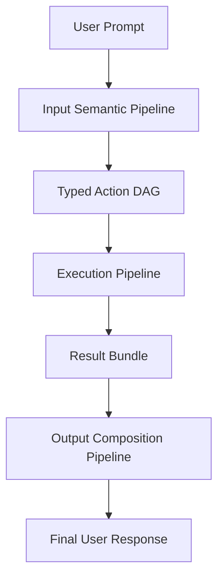
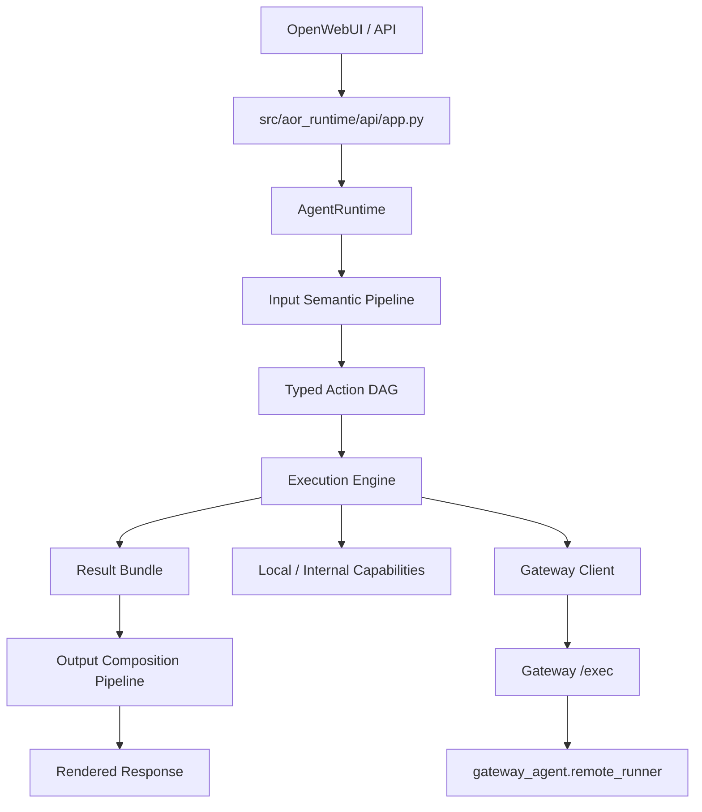
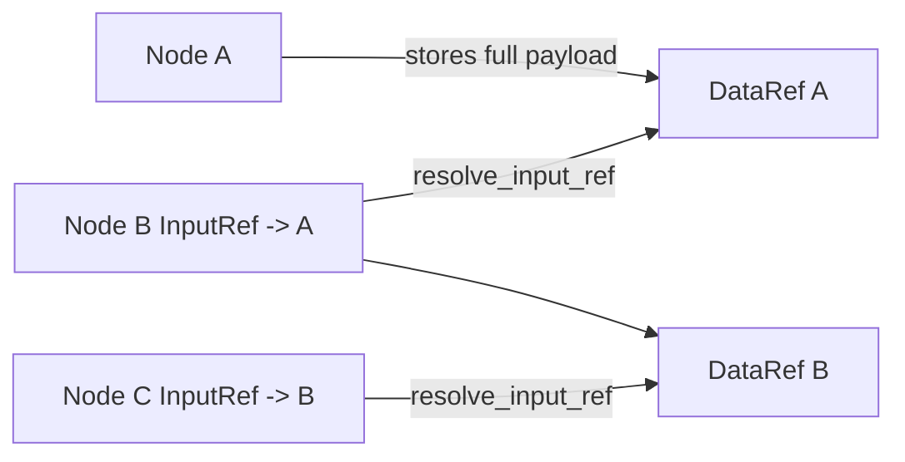
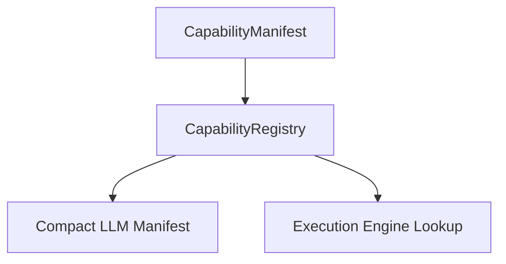
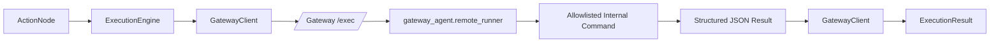
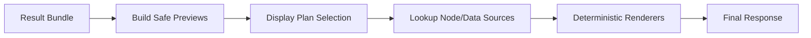

# Agent Runtime Architecture

This document explains the current `agent_runtime` architecture in practical terms.

It is intentionally grounded in the code that exists today, not an aspirational future design.

The system is organized around three major pipelines:

1. Input Semantic Pipeline
2. Execution Pipeline
3. Output Composition Pipeline

At the highest level, the architecture follows one core rule:

> The LLM decides meaning.  
> The runtime enforces structure and safety.  
> The gateway touches the real environment.


## Why This System Exists

This is not a free-form "LLM writes commands" agent.

Instead, it is a schema-driven runtime where:

- the LLM interprets user intent into typed structures;
- the runtime validates, normalizes, and constrains those structures;
- the execution engine runs a typed action graph;
- environment-facing capabilities run through the gateway;
- rendering stays local and deterministic.

That separation matters because it gives us:

- a real safety boundary;
- clearer debugging;
- a cleaner path to adding capabilities;
- deployment flexibility when the runtime is not on the machine that should do the work.


## High-Level Mental Model



In plain English:

1. We receive a natural-language prompt.
2. The LLM turns it into typed semantic decisions.
3. The runtime converts those decisions into a validated DAG of actions.
4. The engine executes those actions safely.
5. Full outputs are stored as typed references.
6. Only safe previews are used for output planning.
7. The runtime renders the final answer.


## System Block Diagram




## Repository Map

The major pieces live here:

- API entrypoint:
  - [src/aor_runtime/api/app.py](/home/vraj/Desktop/workspace/openfabric/src/aor_runtime/api/app.py)
- Top-level runtime orchestrator:
  - [src/agent_runtime/core/orchestrator.py](/home/vraj/Desktop/workspace/openfabric/src/agent_runtime/core/orchestrator.py)
- Core typed models:
  - [src/agent_runtime/core/types.py](/home/vraj/Desktop/workspace/openfabric/src/agent_runtime/core/types.py)
- Input semantic stages:
  - [src/agent_runtime/input_pipeline](/home/vraj/Desktop/workspace/openfabric/src/agent_runtime/input_pipeline)
- Capability contracts and registry:
  - [src/agent_runtime/capabilities](/home/vraj/Desktop/workspace/openfabric/src/agent_runtime/capabilities)
- Execution:
  - [src/agent_runtime/execution](/home/vraj/Desktop/workspace/openfabric/src/agent_runtime/execution)
- Output composition:
  - [src/agent_runtime/output_pipeline](/home/vraj/Desktop/workspace/openfabric/src/agent_runtime/output_pipeline)
- Gateway app and remote tool runner:
  - [gateway_agent/app.py](/home/vraj/Desktop/workspace/openfabric/gateway_agent/app.py)
  - [gateway_agent/remote_runner.py](/home/vraj/Desktop/workspace/openfabric/gateway_agent/remote_runner.py)


## Top-Level Request Flow

The main runtime flow is implemented in [src/agent_runtime/core/orchestrator.py](/home/vraj/Desktop/workspace/openfabric/src/agent_runtime/core/orchestrator.py).

`AgentRuntime.handle_request(...)` does this:

1. create a `UserRequest`;
2. classify the prompt;
3. short-circuit simple no-tool questions into a placeholder direct-answer path;
4. decompose the prompt into tasks;
5. assign semantic verbs;
6. select capabilities;
7. extract typed arguments;
8. build the action DAG;
9. evaluate DAG safety;
10. execute the DAG;
11. compose the final output.

That means the orchestrator owns the pipeline, but not the details of each stage.


## Core Typed Contracts

The most important architectural improvement in this system is that it now has a real typed backbone.

Primary models live in [src/agent_runtime/core/types.py](/home/vraj/Desktop/workspace/openfabric/src/agent_runtime/core/types.py).

### Request / Semantics

- `UserRequest`
  - raw prompt plus user/session/safety context
- `TaskFrame`
  - one semantic task extracted from the prompt
- `CapabilityRef`
  - a candidate capability match for a task

### Execution Planning

- `ActionNode`
  - one executable node with capability, args, dependencies, and safety labels
- `ActionDAG`
  - validated action graph

### Typed Dataflow

- `InputRef`
  - typed reference from one node argument to another node's output
- `DataRef`
  - typed handle for one stored execution payload

### Execution Results

- `ExecutionResult`
  - result for one node
- `ResultBundle`
  - aggregate result for the DAG

### Output Planning

- `DisplayPlan`
  - chosen output style and section plan
- `RenderedOutput`
  - final rendered text plus metadata


## Input Semantic Pipeline

The input pipeline turns raw language into a typed action graph.

It is the most LLM-heavy part of the runtime.


## Where the LLM Is Used

The current runtime uses the LLM in six active stages.

All structured LLM calls flow through:

- [src/agent_runtime/llm/client.py](/home/vraj/Desktop/workspace/openfabric/src/agent_runtime/llm/client.py)
- [src/agent_runtime/llm/structured_call.py](/home/vraj/Desktop/workspace/openfabric/src/agent_runtime/llm/structured_call.py)

The runtime pattern is:

1. build a stage-specific prompt;
2. require JSON-only output;
3. validate against a Pydantic model;
4. apply deterministic post-processing and safety checks.


### Stage 1: Prompt Classification

File:

- [src/agent_runtime/input_pipeline/decomposition.py](/home/vraj/Desktop/workspace/openfabric/src/agent_runtime/input_pipeline/decomposition.py)

Function:

- `classify_prompt(...)`

The LLM decides:

- prompt type:
  - `simple_question`
  - `simple_tool_task`
  - `compound_tool_task`
  - `complex_workflow`
  - `ambiguous`
  - `unsupported`
- whether tools are needed;
- likely domains;
- risk level;
- whether clarification is needed.

The runtime then:

- validates the `PromptClassification` schema;
- applies a small deterministic normalization layer for obvious system prompts such as:
  - `pwd`
  - `current working directory`
  - `git status`
  - `which`
  - process inspection
  - port inspection
  - readonly test-running prompts

Why this stage exists:

- it gives the runtime a first routing decision;
- it lets obvious no-tool questions short-circuit;
- it provides early domain hints.


### Stage 2: Task Decomposition

File:

- [src/agent_runtime/input_pipeline/decomposition.py](/home/vraj/Desktop/workspace/openfabric/src/agent_runtime/input_pipeline/decomposition.py)

Function:

- `decompose_prompt(...)`

The LLM decides:

- how many user-meaningful tasks exist;
- task descriptions;
- task dependencies and ordering;
- global constraints.

Examples of global constraints:

- path hints;
- limits;
- date ranges;
- output preferences;
- table names;
- row limits;
- safety hints.

The runtime then:

- validates that dependency references are well formed.

Why this stage exists:

- it converts one natural-language prompt into a typed task set.


### Stage 3: Semantic Verb Assignment

File:

- [src/agent_runtime/input_pipeline/verb_classification.py](/home/vraj/Desktop/workspace/openfabric/src/agent_runtime/input_pipeline/verb_classification.py)

Function:

- `assign_semantic_verbs(...)`

The LLM decides:

- one controlled semantic verb per task:
  - `read`
  - `search`
  - `create`
  - `update`
  - `delete`
  - `transform`
  - `analyze`
  - `summarize`
  - `compare`
  - `execute`
  - `render`
  - `unknown`
- `object_type`
- `intent_confidence`
- `risk_level`
- `requires_confirmation`

The runtime then:

- normalizes risk rules;
- forces delete-like tasks to require confirmation;
- keeps read/search/analyze/summarize/render low-risk by default;
- raises `execute` out of low-risk unless there is a good reason not to.

Why this stage exists:

- it gives each task a stable semantic shape before capability matching.


### Stage 4: Capability Selection

File:

- [src/agent_runtime/input_pipeline/domain_selection.py](/home/vraj/Desktop/workspace/openfabric/src/agent_runtime/input_pipeline/domain_selection.py)

Function:

- `select_capabilities(...)`

The LLM sees:

- one task at a time;
- the compact exported capability manifest.

The LLM decides:

- ranked candidate capabilities;
- the selected capability;
- confidence;
- reasoning.

Example:

```json
{
  "capability_id": "shell.git_status",
  "operation_id": "git_status",
  "confidence": 0.92,
  "reason": "The task asks for repository status information."
}
```

The runtime then:

- checks the capability exists;
- checks the operation id matches the manifest;
- rejects low-confidence matches;
- rejects semantic-verb mismatches unless the justification is unusually strong.

Why this stage exists:

- this is where user meaning becomes a concrete tool identity.


### Stage 5: Argument Extraction

File:

- [src/agent_runtime/input_pipeline/argument_extraction.py](/home/vraj/Desktop/workspace/openfabric/src/agent_runtime/input_pipeline/argument_extraction.py)

Function:

- `extract_arguments(...)`

The LLM sees:

- task description;
- global constraints;
- selected capability manifest;
- required arguments;
- optional arguments;
- examples.

The LLM decides:

- typed arguments for the chosen capability.

Example:

```json
{
  "path": "."
}
```

The runtime then:

- normalizes current-directory phrases like `this folder`, `here`, and `current directory`;
- clamps limits;
- blocks path traversal;
- applies defaults like `limit=100` or `limit=1000` where appropriate;
- marks missing required args;
- refuses execution if the required args are still missing.

Why this stage exists:

- it converts natural language into typed capability arguments without allowing the LLM to become the command authority.


### Stage 6: Display Plan Selection

Files:

- [src/agent_runtime/output_pipeline/display_selection.py](/home/vraj/Desktop/workspace/openfabric/src/agent_runtime/output_pipeline/display_selection.py)
- [src/agent_runtime/output_pipeline/orchestrator.py](/home/vraj/Desktop/workspace/openfabric/src/agent_runtime/output_pipeline/orchestrator.py)

Function:

- `select_display_plan(...)`

The LLM sees:

- original prompt;
- compact DAG summary;
- compact result summary;
- safe previews only;
- available display types.

The LLM decides:

- whether the result should render as:
  - `plain_text`
  - `markdown`
  - `table`
  - `json`
  - `code_block`
  - `multi_section`
- how sections should be labeled and sourced.

The runtime then:

- validates that the display plan only references existing safe sources;
- resolves payloads deterministically;
- renders the final text locally.

Why this stage exists:

- it lets output shape adapt to the task without giving the LLM access to raw full results.


## What the LLM Does Not Control

The LLM does **not** control:

- shell command construction;
- gateway routing;
- path normalization;
- safety policy;
- cycle detection;
- dependency validation;
- `InputRef` resolution;
- full result storage;
- gateway remote execution;
- deterministic rendering.

Those are all runtime-owned or gateway-owned.


## Maximizing LLM Use Without Trusting the LLM

This runtime now intentionally uses the LLM more often, but gives it no additional authority.

That distinction is the whole point of the refactor.

### The LLM's role

The LLM is used as:

- a semantic proposer;
- a decomposition proposer;
- a decomposition critic;
- a verb classifier;
- a capability ranker;
- an argument proposer;
- a DAG reviewer;
- a failure repair assistant;
- a display-plan proposer.

In other words, the LLM is now asked to do more of the "thinking about what the user probably means" work.

### The runtime's role

The runtime remains the authority for:

- schema validation;
- normalization;
- capability existence checks;
- argument validation;
- DAG construction;
- dependency validation;
- `InputRef` validation;
- safety policy;
- execution readiness;
- gateway routing;
- actual execution;
- final rendering.

The important boundary is:

> The LLM may propose, critique, rank, explain, and repair.  
> The runtime alone may validate, authorize, and execute.

### Proposal, critique, validation, repair

The current design now wraps several stages with a tighter pattern:

```text
LLM proposal
  -> deterministic validation
  -> optional LLM critique or review
  -> deterministic acceptance or rejection
  -> trusted runtime object
```

For selected stages, the runtime can also generate multiple LLM candidates and choose among them deterministically.

This lets us increase LLM usage without letting raw LLM output become executable truth.

### Why reproducibility does not come from deterministic LLM behavior

The system does **not** assume the LLM is deterministic.

Instead, reproducibility comes from recording:

- what the LLM proposed;
- what the runtime accepted or rejected;
- what deterministic normalizations were applied;
- what safety decision was made;
- what final trusted DAG was produced.

That information is stored in a `PlanningTrace`.

So reproducibility here means:

> We can replay the validated plan.  
> We do not need the model to say the exact same thing again.

### Replay model

Replay works from the trusted end of the pipeline:

1. load a `PlanningTrace`;
2. recover the validated `ActionDAG`;
3. verify `final_dag_hash`;
4. verify the DAG was marked `execution_ready`;
5. re-execute the trusted DAG without calling the LLM again.

This is a stronger reproducibility story than "set temperature to zero and hope."

### Adding a capability safely

The safe way to add a new capability is:

1. add a new manifest to the registry;
2. define its typed argument schema and output shape;
3. decide whether it is `gateway`, `local`, or `internal`;
4. implement deterministic validation in the capability itself;
5. make execution backend behavior explicit;
6. add safety coverage;
7. add tests proving LLM proposals cannot bypass the capability contract.

The LLM should only ever learn:

- what the capability means;
- what arguments it can take;
- what kind of result it produces.

It should never become the authority for:

- command strings;
- backend transport;
- mutation semantics;
- permission grants.


## Action DAG and Validation

The action DAG is the contract between semantic planning and execution.

Primary model:

- [ActionDAG](/home/vraj/Desktop/workspace/openfabric/src/agent_runtime/core/types.py)

Each `ActionNode` contains:

- `id`
- `task_id`
- `description`
- `semantic_verb`
- `capability_id`
- `operation_id`
- `arguments`
- `depends_on`
- `safety_labels`
- `dry_run`

### DAG Validation Rules

The runtime enforces:

- node ids must be unique;
- dependencies must point to existing nodes;
- the graph must be acyclic;
- `unknown` capabilities must be explicitly marked unresolved;
- every `InputRef` producer must exist;
- every `InputRef` producer must be in the dependency chain.

That validation lives mainly in:

- [src/agent_runtime/core/types.py](/home/vraj/Desktop/workspace/openfabric/src/agent_runtime/core/types.py)


## Typed Dataflow: InputRef and DataRef

This is one of the most important newer pieces of the architecture.

The runtime now supports workflows where one node consumes the output of another node through a typed reference rather than through raw prompt text or hand-wired runtime state.



### DataRef

`DataRef` represents:

- a stable `ref_id`;
- the producer node id;
- a coarse `data_type`;
- a safe preview;
- metadata.

### InputRef

`InputRef` represents:

- `source_node_id`
- optional `output_key`
- optional `expected_data_type`

### Why this matters

This turns the DAG into a real workflow graph:

- upstream outputs can feed downstream nodes;
- the engine can validate dataflow explicitly;
- the runtime can keep full data private while still making workflows possible.


## Execution Pipeline

The execution pipeline is the deterministic heart of the runtime.


Primary files:

- [src/agent_runtime/execution/engine.py](/home/vraj/Desktop/workspace/openfabric/src/agent_runtime/execution/engine.py)
- [src/agent_runtime/execution/safety.py](/home/vraj/Desktop/workspace/openfabric/src/agent_runtime/execution/safety.py)
- [src/agent_runtime/execution/result_store.py](/home/vraj/Desktop/workspace/openfabric/src/agent_runtime/execution/result_store.py)


## Safety Gate

Before execution, the runtime evaluates the DAG through:

- `evaluate_dag_safety(...)`

The safety gate enforces rules such as:

- unknown capabilities are blocked;
- delete operations require confirmation;
- update/create operations require confirmation unless allowlisted low-risk;
- shell execution is blocked unless configuration enables it;
- environment-facing capabilities must be gateway-backed;
- paths must stay inside workspace root;
- obvious secret files are blocked;
- output preview size is bounded;
- SQL writes are blocked unless explicitly supported and confirmed.

This is a runtime safety boundary, not an LLM decision.


## Execution Engine Responsibilities

The engine does the following in order:

1. evaluate DAG safety;
2. return structured error bundles when blocked;
3. topologically sort the DAG;
4. execute nodes in dependency order;
5. skip downstream nodes when required upstream nodes fail;
6. resolve any `InputRef` arguments before execution;
7. execute through the correct backend;
8. store successful payloads as `DataRef`;
9. attach only safe previews to the `ExecutionResult`;
10. return a `ResultBundle`.

### InputRef Resolution Rules

Before executing a node, the engine:

- checks that each referenced producer is in the dependency chain;
- checks that the producer actually executed;
- checks that the producer succeeded;
- checks that the stored `data_type` matches `expected_data_type` when one is declared;
- resolves the full data from the `ResultStore`.

That means downstream execution is deterministic and typed, even if the upstream planning came from the LLM.


## Result Store

Primary file:

- [src/agent_runtime/execution/result_store.py](/home/vraj/Desktop/workspace/openfabric/src/agent_runtime/execution/result_store.py)

Responsibilities:

- stores full successful payloads by `DataRef`;
- returns full data for deterministic downstream execution;
- resolves `InputRef`;
- generates bounded JSON-safe previews;
- keeps previews separate from full data.

This is one of the strongest safety boundaries in the current system:

> downstream deterministic execution can use full stored data,  
> but LLM-based output planning only sees safe previews by default.


## Capability System

Capabilities are the bridge between semantic meaning and executable behavior.

Primary files:

- [src/agent_runtime/capabilities/schemas.py](/home/vraj/Desktop/workspace/openfabric/src/agent_runtime/capabilities/schemas.py)
- [src/agent_runtime/capabilities/registry.py](/home/vraj/Desktop/workspace/openfabric/src/agent_runtime/capabilities/registry.py)
- [src/agent_runtime/capabilities/__init__.py](/home/vraj/Desktop/workspace/openfabric/src/agent_runtime/capabilities/__init__.py)

### Capability Manifest

Each capability declares:

- `capability_id`
- `domain`
- `operation_id`
- `name`
- `description`
- `semantic_verbs`
- `object_types`
- `argument_schema`
- `required_arguments`
- `optional_arguments`
- `output_schema`
- `execution_backend`
- `backend_operation`
- `risk_level`
- `read_only`
- `mutates_state`
- `requires_confirmation`
- `examples`
- `safety_notes`

### Capability Exposure Diagram



### What the LLM Sees

The LLM sees only a compact safe export containing:

- `capability_id`
- `operation_id`
- `domain`
- `description`
- `semantic_verbs`
- `object_types`
- `required_arguments`
- `optional_arguments`
- `risk_level`
- `read_only`
- `examples`

### What the LLM Does Not See

The LLM does **not** see:

- command templates;
- shell commands;
- gateway transport details;
- backend operation names;
- execution backend routing rules;
- implementation code.

That boundary is deliberate. The model chooses semantic tools, not execution transport.


## Current Capability Inventory

The default registry is built in:

- [src/agent_runtime/capabilities/__init__.py](/home/vraj/Desktop/workspace/openfabric/src/agent_runtime/capabilities/__init__.py)

### Filesystem

Gateway-backed:

- `filesystem.list_directory`
- `filesystem.read_file`
- `filesystem.search_files`

These are environment-facing, so they execute remotely through the gateway.

### Shell

Gateway-backed and constrained:

- `shell.which`
- `shell.pwd`
- `shell.list_processes`
- `shell.check_port`
- `shell.git_status`
- `shell.run_tests_readonly`

These are read-only capabilities with typed argument schemas. The runtime never treats the LLM as the command authority.

### SQL

Local / placeholder:

- `sql.read_query`

This currently accepts structured query intent rather than arbitrary LLM-generated SQL. It is not yet a full DICOM/SQL execution layer.

### Local Data Processing

Local:

- `python_data.transform_table`

This performs deterministic in-memory transforms on already available structured data.

### Rendering

Internal:

- `markdown.render`

This is an output capability, not an environment-touching capability.


## Backend Routing Model

One of the important design choices in the runtime is that semantic identity and execution transport are separate.

The LLM chooses:

- `filesystem.read_file`
- `shell.git_status`
- `markdown.render`

The runtime then routes by manifest backend:

- `gateway`
- `local`
- `internal`

That routing decision is runtime-owned, not LLM-owned.


## Gateway-Backed Execution

Environment-facing tools execute through the gateway.

Primary files:

- [src/agent_runtime/execution/gateway_client.py](/home/vraj/Desktop/workspace/openfabric/src/agent_runtime/execution/gateway_client.py)
- [gateway_agent/app.py](/home/vraj/Desktop/workspace/openfabric/gateway_agent/app.py)
- [gateway_agent/remote_runner.py](/home/vraj/Desktop/workspace/openfabric/gateway_agent/remote_runner.py)



### Why the gateway exists

The runtime may run:

- in Docker;
- in a control-plane service;
- on a machine that should not directly access the target environment.

The gateway acts as remote hands.

So the split is:

- runtime chooses semantic tool;
- runtime enforces safety and typed arguments;
- gateway performs actual environment access.


## Remote Runner Model

The remote runner lives in:

- [gateway_agent/remote_runner.py](/home/vraj/Desktop/workspace/openfabric/gateway_agent/remote_runner.py)

It accepts:

- `--operation`
- `--payload` (base64 JSON)

It then:

1. validates the operation against an allowlist;
2. validates required and optional arguments;
3. normalizes the path/workspace context;
4. executes an internally constructed command or filesystem action;
5. emits one structured JSON envelope.

This is a crucial design point:

> The gateway does not execute prompt-derived shell text.  
> It executes runtime-chosen operations with runtime-validated arguments.


## Constrained Shell Family

The shell family is intentionally narrow and hardcoded for safety.

The LLM may say:

```json
{
  "capability_id": "shell.check_port",
  "arguments": {
    "port": 8310
  }
}
```

But the LLM may **not** say:

```text
lsof -i :8310
```

The actual command construction happens internally inside the remote runner.

That is one of the strongest boundaries in the current system.


## Output Composition Pipeline

The output pipeline turns typed execution results into the final user-visible answer.



Primary files:

- [src/agent_runtime/output_pipeline/orchestrator.py](/home/vraj/Desktop/workspace/openfabric/src/agent_runtime/output_pipeline/orchestrator.py)
- [src/agent_runtime/output_pipeline/display_selection.py](/home/vraj/Desktop/workspace/openfabric/src/agent_runtime/output_pipeline/display_selection.py)
- [src/agent_runtime/output_pipeline/renderers.py](/home/vraj/Desktop/workspace/openfabric/src/agent_runtime/output_pipeline/renderers.py)

### Output behavior

- error bundles render deterministically;
- partial bundles render deterministically;
- only success bundles invoke LLM-guided display selection;
- safe previews are redacted before display planning;
- full stored data is only dereferenced if policy explicitly allows it.

### Important safety boundary

By default:

- the display-planning LLM sees only safe previews;
- it does not see full stored payloads;
- it does not see raw gateway stdout/stderr unless those were already normalized into safe structured previews.


## Concrete End-to-End Example: Git Status

Prompt:

`show git status for this repository`

### Step-by-step

1. The API layer receives the prompt through `/v1/chat/completions`.
2. `AgentRuntime` builds a `UserRequest`.
3. The LLM classifies the prompt as a tool-backed request.
4. The LLM decomposes it into a task.
5. The LLM assigns a semantic verb such as `read` or `analyze`.
6. The LLM selects `shell.git_status`.
7. The LLM extracts arguments, usually `{"path": "."}`.
8. The runtime builds a one-node DAG.
9. The safety gate verifies shell policy, path constraints, and backend rules.
10. The execution engine routes the node to the gateway because the capability backend is `gateway`.
11. The gateway client builds a deterministic invocation of `python3 -m gateway_agent.remote_runner ...`.
12. The remote runner validates the operation and internally constructs:

```text
git -C <repo_path> status --short --branch
```

13. The remote runner returns a structured JSON envelope with parsed status lines.
14. The execution engine stores the full result in `ResultStore` as a `DataRef`.
15. The output pipeline builds safe previews from the result bundle.
16. The display-planning LLM chooses a display plan using only safe previews.
17. Deterministic renderers produce the final response shown to the user.


## What Is Flexible

These are the strongest, most flexible parts of the current architecture.

### 1. Typed contracts

The system has real typed objects for:

- semantics;
- planning;
- execution;
- dataflow;
- result bundling;
- output planning.

That gives the runtime a real backbone.

### 2. Capability registry

New capabilities can be added through manifests and registration, rather than rewriting the whole pipeline.

### 3. Backend abstraction

The same semantic capability pattern supports:

- `gateway`
- `local`
- `internal`

This cleanly separates meaning from transport.

### 4. Gateway as remote substrate

Environment-facing work is decoupled from the machine that hosts the agent runtime.

### 5. Typed result references

`InputRef` and `DataRef` make true workflows possible without exposing full result payloads to the LLM.


## What Is Hardcoded

Some hardcoding is intentional and good. Some is temporary and pragmatic.

### 1. The constrained shell family

Allowed shell operations are explicitly enumerated in the remote runner. This is good hardcoding because it limits blast radius.

### 2. Classification rescue rules

Some obvious shell/system prompts are explicitly normalized after LLM classification. This is pragmatic, but not the long-term ideal.

### 3. Data type inference

The execution engine still infers coarse output types from payload shapes like:

- `rows`
- `entries`
- `processes`
- `listeners`
- `content_preview`
- `summary`
- `value`

That works, but it is still heuristic.

### 4. Renderer knowledge of payload families

The renderers know about specific payload keys:

- `entries`
- `rows`
- `matches`
- `processes`
- `listeners`
- `status_lines`
- `stdout_lines`
- `stderr_lines`

This is effective, but not fully generalized.

### 5. Gateway defaults and config bridging

Some gateway fallback behavior and shell-mode bridging are explicit in code today rather than arising from a more unified configuration abstraction.


## What Is Brittle

This is the honest part of the architecture.

### 1. Semantic edge reliability

The LLM-driven stages are structured, but some prompt families still need deterministic rescue logic. That means the semantic contract is good, but not yet fully self-sufficient.

### 2. Capability breadth

The architecture is stronger than the current capability surface.

Today the runtime is strongest in:

- filesystem;
- constrained shell;
- markdown rendering;
- deterministic local table transforms.

It is still weaker in:

- rich SQL/DICOM execution;
- broad cross-domain workflows;
- deeper natural-language-to-dataflow inference.

### 3. Output generalization

Display selection is flexible, but the deterministic renderers still rely on some payload-family knowledge.

### 4. Environment topology effects

Some capabilities depend on what the gateway host can actually observe.

Example:

- `shell.check_port` can behave differently depending on process namespace visibility.

That is a deployment/topology issue as much as a software issue.

### 5. Prompt-to-dataflow planning depth

The runtime now supports typed dataflow well, but the planner is still only moderately smart about turning rich compound prompts into multi-step `InputRef`-driven workflows automatically.


## Current Architectural Maturity

If we summarize the current state plainly:

### Strong today

- typed request -> DAG -> result pipeline
- capability registry
- gateway-backed environment execution
- constrained shell family
- safe preview boundary
- typed `InputRef` / `DataRef` dataflow
- local deterministic rendering

### Medium today

- prompt classification robustness
- capability selection accuracy at the edges
- output generality
- rich multi-step dataflow planning from natural language

### Weaker today

- SQL/DICOM depth
- large capability surface coverage
- broad compound workflow coverage across many domains


## One-Sentence Summary

If we had to explain this runtime to another engineer in one sentence:

> This is a schema-driven agent runtime where the LLM proposes typed meaning, the runtime validates and executes a safe action DAG, the gateway performs environment-facing work remotely, and the runtime renders the final answer from safe structured results.


## Runtime Self-Introspection

The runtime now includes a small internal `runtime.*` capability family so meta-questions about the runtime are answered from deterministic runtime state rather than from generic direct answering or LLM invention.

### Why this exists

Prompts like:

- `what are my capabilities?`
- `show pipeline`
- `show last plan`
- `why did that fail?`

are not normal domain tasks. They are questions about the runtime itself.

Those prompts should not rely on:

- free-form direct answering;
- shell commands;
- guessed capability inventories;
- LLM memory of prior runs.

They should come from runtime-owned data structures such as the `CapabilityRegistry`, the current pipeline definition, the last trusted plan summary, and the last safe failure summary.

### Current runtime introspection capabilities

- `runtime.describe_capabilities`
- `runtime.describe_pipeline`
- `runtime.show_last_plan`
- `runtime.explain_last_failure`

These are `execution_backend="internal"` capabilities:

- they do not go through the gateway;
- they do not execute shell commands;
- they do not mutate state;
- they expose only sanitized metadata.

### What they read from

`runtime.describe_capabilities`
- reads from `CapabilityRegistry`
- groups registered capabilities by domain
- exposes safe manifest metadata only

`runtime.describe_pipeline`
- returns a deterministic description of the current runtime pipeline
- identifies which stages are LLM-assisted versus deterministic

`runtime.show_last_plan`
- reads the runtime-owned safe summary of the last trusted plan
- includes prompt, task summaries, selected capabilities, DAG nodes, and safety decision
- does not expose raw tool outputs

`runtime.explain_last_failure`
- reads the runtime-owned safe summary of the last failure
- includes category, stage, and safe reason
- does not expose sensitive payloads or internal traceback text

### Routing model

Meta prompts are normalized into tool-backed runtime tasks rather than falling into the generic direct-answer placeholder path.

Examples:

- `what are my capabilities?` -> `runtime.describe_capabilities`
- `show pipeline` -> `runtime.describe_pipeline`
- `show last plan` -> `runtime.show_last_plan`
- `what went wrong?` -> `runtime.explain_last_failure`

This routing is deterministic and advisory-LLM-safe:

- the LLM may still classify and decompose the prompt;
- the runtime normalizes these prompt families into the `runtime` domain;
- capability selection can deterministically override to the appropriate `runtime.*` capability when the prompt matches a known introspection family.

### Safety boundary

The introspection layer intentionally does not expose:

- backend command strings;
- gateway runner invocation details;
- shell templates;
- raw tool outputs;
- secrets;
- tracebacks.

This keeps runtime self-description useful without turning it into an escape hatch around the normal safety boundary.


## Dataflow Planning as Core Architecture

The runtime now treats producer-consumer workflows as a first-class planning concern rather than an accidental side effect of execution ordering.

### Why this matters

The execution layer already supported:

- `DataRef`
- `InputRef`
- `ResultStore`
- DAG validation for producer/consumer dependencies

but the semantic pipeline was still weak at creating those workflows from natural language.

That gap showed up in prompts like:

- `total file size in this directory`
- `list all files in this directory and compute the total file size`
- `count files in this directory`
- `find python files and count them`

The problem was not the executor. The problem was that the planner was not reliably turning natural language into:

- one producer task;
- one deterministic data primitive;
- a validated `InputRef` between them.

### New planning stage

The top-level flow now includes a dedicated dataflow planning phase after capability selection:

```text
classification
-> decomposition
-> verb assignment
-> capability selection
-> dataflow planning
-> argument extraction
-> DAG construction
-> safety
-> execution
-> output
```

This placement is intentional:

- the runtime first decides what the base tasks are;
- then it decides which capabilities those tasks map to;
- then it asks whether any validated producer outputs should feed deterministic derived tasks.

If a future Capability Fit layer is added, dataflow planning should remain after that fit stage.

### LLM role in dataflow planning

The LLM may propose:

- producer-consumer references;
- derived tasks;
- dependency edges.

Examples:

- `filesystem.list_directory -> data.aggregate`
- `filesystem.search_files -> data.aggregate`
- `filesystem.search_files -> data.head`
- `filesystem.list_directory -> data.project`

The LLM is not allowed to generate:

- shell commands;
- Python code;
- SQL;
- arbitrary expressions.

So the LLM helps with semantic structure, but not execution authority.

### Deterministic validation boundary

The runtime validates every proposed dataflow artifact before it can reach the DAG.

Examples of enforced checks:

- producer task exists;
- consumer task exists;
- consumer argument is declared on the manifest;
- derived capability exists;
- derived capability is read-only and non-mutating;
- new dependency edges do not create cycles;
- expected data types are compatible when known;
- low-confidence refs are rejected unless deterministic schema evidence supports them.

No raw LLM dataflow proposal reaches execution directly.

### Generic internal data primitives

The runtime now exposes small internal data capabilities that operate on structured upstream results:

- `data.aggregate`
- `data.project`
- `data.head`

These capabilities are:

- internal;
- deterministic;
- read-only;
- expression-free.

They operate on supported structured payload families such as:

- `entries`
- `rows`
- `matches`
- `processes`
- `listeners`
- direct `list[dict]`

This turns common chaining patterns into safe reusable architecture rather than prompt-specific hacks.

### How the pieces fit together

For a prompt like:

`list all files in this directory and compute the total file size`

the intended flow becomes:

1. base task: `filesystem.list_directory(path=".")`
2. derived task: `data.aggregate(operation="sum", field="size", filter={"type": "file"})`
3. validated `InputRef` from the listing node to the aggregate node
4. deterministic execution
5. rendering from the aggregate result rather than the raw file list

That is the important architectural shift:

the runtime is no longer limited to “one prompt -> one direct tool.”

It can now express:

`producer capability -> deterministic data primitive -> rendered result`

using the same trusted DAG and result-store boundaries as the rest of the system.

## Typed Result Shapes and Rendering

The output pipeline now normalizes execution results into semantic result shapes before rendering.

This matters because raw execution payloads are often shaped for transport or storage, not for direct presentation. A renderer that reads those payloads ad hoc can easily produce the wrong answer even when execution itself succeeded. The concrete failure we saw was aggregate-style prompts rendering file names instead of a scalar total.

### The normalized result-shape layer

The runtime introduces a normalization step in:

- `src/agent_runtime/output_pipeline/result_shapes.py`

This layer converts one `ExecutionResult` into a trusted semantic result shape such as:

- `TextResult`
- `TableResult`
- `RecordListResult`
- `ScalarResult`
- `AggregateResult`
- `FileContentResult`
- `DirectoryListingResult`
- `ProcessListResult`
- `CapabilityListResult`
- `ErrorResult`
- `MultiSectionResult`

Normalization uses:

- capability identity from result metadata;
- safe previews by default;
- full stored data from `ResultStore` only when policy explicitly allows it.

The purpose is to answer:

> what kind of result is this semantically?

before trying to decide:

> how should this be rendered?

### Deterministic normalization rules

Examples of current shape mapping:

- `filesystem.list_directory` -> `DirectoryListingResult`
- `filesystem.search_files` -> `RecordListResult`
- `filesystem.read_file` -> `FileContentResult`
- `data.aggregate` -> `AggregateResult`
- `data.head` -> `RecordListResult`
- `data.project` -> `RecordListResult`
- `runtime.describe_capabilities` -> `CapabilityListResult`
- `shell.list_processes` -> `ProcessListResult`
- `shell.git_status` -> `TextResult`
- `markdown.render` -> `TextResult`

There are also generic fallback rules for payloads containing:

- `rows`
- `entries`
- `matches`
- `value`

When aggregate metadata exists, a `value` payload becomes an `AggregateResult`; otherwise it falls back to a plain `ScalarResult`.

### Renderer behavior

The deterministic renderers in:

- `src/agent_runtime/output_pipeline/renderers.py`

now render from typed result shapes rather than raw payload guesses.

Important examples:

- `AggregateResult` renders a scalar summary with label, value, unit, and optional aggregate metadata.
- `DirectoryListingResult` renders a Markdown table with:
  - `name`
  - `path`
  - `type`
  - `size`
  - `modified_time`
- `CapabilityListResult` renders grouped by domain.
- `MultiSectionResult` renders multiple normalized child sections in order.

This means the renderer no longer has to infer whether a payload that happens to contain file rows is meant to be shown as a table or summarized as a numeric aggregate. That decision has already been made at the normalization layer.

### LLM display planning vs deterministic rendering

The LLM is still allowed to help with display layout selection. It may propose:

- plain text
- markdown
- table
- code block
- multi-section layouts

But the renderer is still authoritative:

- the LLM only sees safe summaries and previews;
- the LLM never sees raw stored result data by default;
- the LLM cannot invent new result shapes;
- the deterministic renderer always renders from validated normalized shapes.

If the LLM display plan is invalid, references missing nodes, or otherwise fails at render time, the runtime falls back to deterministic result-shape rendering.

### Multi-result behavior

When a result bundle contains multiple successful outputs, the fallback renderer builds a `MultiSectionResult`.

For prompts that ask to both list files and compute an aggregate, the fallback ordering prefers:

1. directory listing first
2. aggregate second

This keeps the output aligned with user intent while remaining deterministic.

### Why this improves correctness

The key win is that rendering now happens after semantic normalization.

So instead of:

`raw payload -> heuristic renderer guess`

the runtime now does:

`execution result -> typed result shape -> deterministic renderer`

That reduces a whole class of output bugs where:

- the right tool executed;
- the right data was produced;
- but the renderer showed the wrong semantic form.

In practice, this is what prevents a prompt like:

`total file size in this directory`

from accidentally rendering file names instead of the numeric total.

## LLM-Assisted Capability Fit

One of the easiest ways for an agent runtime to fail is to confuse a generic semantic verb with a true tool match.

For example:

- `list files` and `read README.md` are both read-oriented tasks;
- `how much free memory do I have on this system?` is also read-oriented;
- but those requests do **not** belong to the same capability family.

Without an explicit fit layer, the runtime can wrongly treat “read” as enough evidence and route a system-resource question into a filesystem tool, which then fails with a missing path. That is not a missing-argument problem. It is a capability-fit problem.

### The capability-fit stage

The runtime now inserts an explicit fit gate between:

- capability selection
- dataflow planning
- argument extraction

So the relevant pipeline becomes:

1. classification
2. decomposition
3. verb assignment
4. capability selection
5. **capability fit**
6. dataflow planning
7. argument extraction
8. DAG construction
9. safety
10. execution
11. output composition

### What the LLM does here

The LLM is asked a narrower question than raw capability selection:

> Does this candidate capability truly fit the task, or is it only superficially similar because of a generic verb like `read` or `search`?

The LLM sees:

- original prompt
- task description
- semantic verb
- object type
- task constraints
- likely domains
- compact capability manifest
- required and optional arguments
- risk/read-only metadata
- examples

The LLM does **not** get to:

- execute anything
- emit commands
- bypass the registry
- bypass deterministic validation

It only produces an untrusted `CapabilityFitProposal`.

### What the runtime validates deterministically

The runtime converts the untrusted proposal into a trusted `CapabilityFitDecision`.

A capability is accepted only if deterministic checks agree that it is a true fit. These checks include:

- capability id matches the manifest
- operation id matches the manifest
- semantic verb compatibility
- domain compatibility
- object-type compatibility
- no hard domain mismatch
- no hard object mismatch
- no mutating-task vs read-only-capability contradiction
- LLM status is `fit` (or a fit-compatible status)
- LLM confidence is at least the acceptance threshold

This matters because the runtime can now reject bad “read-shaped” fallbacks even when the LLM is overly optimistic.

### Hard mismatches

The fit layer treats some mismatches as structural, not negotiable. Examples:

- system memory / CPU / disk requests must not fit filesystem tools
- database / DICOM patient or study requests must not fit shell or filesystem tools unless the user is explicitly asking about files by path
- repository / git tasks must not fit generic filesystem reads when a repository capability is expected
- mutating tasks must not fit non-mutating capabilities

These hard mismatches are what stop prompts like:

`how much free memory do I have on this system?`

from collapsing into:

`filesystem.list_directory(path=?)`

### Capability fit vs missing arguments

The fit layer distinguishes:

1. **valid capability fit**
2. **missing required argument for a valid capability**
3. **missing capability / capability gap**
4. **semantic/domain/object mismatch**

That distinction is important.

For:

`read the file`

the runtime should conclude:

- `filesystem.read_file` is a valid fit
- but the file path is missing

So argument extraction still runs, and the user gets a missing-argument outcome.

For:

`how much free memory do I have on this system?`

the runtime should conclude:

- filesystem is the wrong semantic fit
- the real problem is a capability gap, not a missing path

So argument extraction is skipped and the runtime returns a clean unsupported-capability answer instead of a confusing path error.

### Capability gaps

If no candidate survives capability fit, the runtime creates a structured capability-gap description.

That gap description captures:

- what user intent was understood
- what capability is missing
- the suggested domain
- the suggested object type
- a user-facing message

This means unsupported prompts are now reported as:

> the runtime understands what was asked, but does not currently have a compatible capability

instead of:

> some later stage failed with a malformed or misleading argument error

### Why this improves the architecture

Capability selection answers:

> which candidate tool seems closest?

Capability fit answers:

> is that candidate actually a safe semantic match?

That separation is healthy.

It keeps the LLM heavily involved in semantic judgment while still letting the runtime remain the authority on:

- what counts as an acceptable fit
- what counts as a capability gap
- when argument extraction is allowed to proceed
- when executable DAG nodes may be created

In other words:

- the LLM proposes candidates
- the LLM critiques candidate fit
- the runtime decides whether the candidate is truly executable

That is the correct trust boundary for a schema-driven agent runtime.

## Planning Trace and Replay

The runtime now treats reproducibility as a first-class architecture concern.

Because the system intentionally uses the LLM heavily, reproducibility cannot come from pretending the model itself is deterministic. It comes from recording:

- what the LLM proposed;
- what the runtime validated or rejected;
- what final trusted DAG was produced;
- what safety decision was applied.

### What the PlanningTrace records

The planning trace captures a structured summary of the full planning pipeline, including:

- raw prompt;
- model metadata;
- prompt template versions;
- capability manifest hash;
- prompt classification raw and validated outputs;
- decomposition raw and validated outputs;
- verb assignment raw and validated outputs;
- capability candidates by task;
- capability-fit proposals and trusted fit decisions;
- selected capabilities;
- rejected capabilities;
- capability gaps;
- dataflow proposals and validated dataflow;
- rejected dataflow refs;
- argument extraction raw and validated outputs;
- skipped argument extraction by task;
- raw DAG;
- validated DAG;
- final DAG hash;
- safety decision;
- execution-ready status;
- deterministic normalizations;
- validation errors;
- user-facing errors.

This makes the trace the durable explanation of the run, not just a debug log.

### Deterministic plan hashing

The runtime hashes:

- prompt payloads;
- capability manifests;
- validated action DAGs;

using canonical JSON with stable ordering.

That matters because it gives the runtime a reproducible fingerprint of the trusted executable plan. If the validated DAG changes, the hash changes. If the trace says one DAG was accepted but replay sees a different one, replay fails instead of silently executing a different plan.

### Replay model

Replay is intentionally defined around the **validated DAG**, not around re-running the LLM.

In other words:

- the LLM may be nondeterministic;
- the validated DAG is the deterministic contract;
- replay executes the trusted DAG directly.

The replay helper:

- loads the validated DAG from the trace;
- verifies that the DAG hash matches `final_dag_hash`;
- re-executes through the normal execution engine;
- re-runs safety evaluation unless a trusted replay mode is explicitly chosen.

This means replay does **not** depend on re-asking the model what it meant.

### Why this is the right reproducibility boundary

Trying to reproduce an LLM-heavy run by hoping the model says the same thing again is fragile.

Trying to reproduce it from a validated DAG trace is much stronger:

- the semantic planning work has already been constrained and validated;
- unsafe or invalid proposals have already been filtered out;
- the execution engine sees only trusted runtime objects.

So the runtime’s reproducibility story becomes:

`LLM proposal history + deterministic acceptance/rejection + validated DAG hash + replay`

rather than:

`ask the model again and hope`

### What the trace deliberately does not store

The trace is not a raw execution dump.

It should not store:

- secrets;
- full raw tool output;
- unrestricted remote execution payloads;
- arbitrary environment data.

This is why the trace is useful for reproducibility without becoming a dangerous transcript of everything the system touched.

## LLM Critique and Repair

### Why this layer exists

The runtime now uses the LLM more aggressively, but it still does not trust the LLM with authority.

That means we let the model help in four specific ways:

- critique a proposed task decomposition;
- review a trusted DAG as an advisory checker;
- propose one safe repair after a failed execution;
- help explain what went wrong in structured, bounded terms.

The runtime remains the authority.

### Decomposition critique

After the runtime selects the best decomposition proposal, it can send that proposal back to the LLM for critique.

The critique sees:

- the original prompt;
- the proposed tasks;
- global constraints;
- a registry/domain summary.

The critique may flag:

- missing user intents;
- hallucinated tasks;
- dependency warnings;
- unsafe task warnings;
- unresolved references;
- a recommended repair payload.

This critique is advisory only.

The runtime may allow one repair attempt to the decomposition stage, but it still validates the repaired result against the trusted `DecompositionResult` schema and dependency rules before continuing.

### DAG review

After deterministic DAG construction, the runtime can ask the LLM to review a sanitized DAG view.

The review sees:

- the original prompt;
- node ids;
- capability ids;
- operation ids;
- argument previews;
- dependency edges;
- safe capability summaries.

The review does **not** see:

- shell commands;
- gateway internals;
- secrets;
- raw execution output.

The review may return:

- missing user intents;
- suspicious nodes;
- dependency warnings;
- dataflow warnings;
- output expectation warnings;
- a recommended repair payload.

Any recommended repair is validated before use. If the review references unknown nodes or malformed targets, the runtime discards it and falls back to a zero-confidence advisory result.

### Failure repair

If execution fails safely, the runtime can ask the LLM for exactly one bounded repair proposal.

The repair prompt includes:

- the original prompt;
- failed node metadata;
- a sanitized error;
- the capability manifest summary;
- the previous validated arguments.

The repair proposal may suggest:

- retrying with corrected arguments;
- trying an alternate capability;
- skipping with explanation;
- asking the user for clarification.

But a repair is never applied directly.

The runtime still requires that any repaired plan pass:

- capability existence checks;
- argument validation;
- capability-fit validation for alternate capabilities;
- safety evaluation;
- confirmation requirements.

Repairs are also rejected if they try to introduce:

- path traversal;
- arbitrary shell command fields;
- unsafe shell-like argument text;
- confirmation bypass.

The default policy is at most one repair retry per request.

### Runtime authority vs LLM assistance

This layer shows the core contract of the system very clearly:

- the **LLM proposes**;
- the **runtime validates**;
- the **safety gate authorizes**;
- the **engine executes**.

The model can critique, explain, and propose repairs, but it still cannot:

- execute anything;
- bypass capability schemas;
- bypass capability fit;
- bypass safety policy;
- bypass confirmation;
- mutate runtime state directly.

### Traceability

Critique, DAG review, and repair attempts are recorded in the `PlanningTrace`.

That means we can inspect:

- what the LLM advised;
- what the runtime accepted;
- what the runtime rejected;
- whether a repair was attempted;
- whether the repair was blocked by deterministic validation.

This keeps the system auditable even as it becomes more LLM-assisted.

## Safe System Inspection

The runtime now includes a small read-only `system.*` capability family for safe remote inspection of host resource status.

These capabilities are:

- `system.memory_status`
- `system.disk_usage`
- `system.cpu_load`
- `system.uptime`
- `system.environment_summary`

### Design intent

These are not arbitrary shell capabilities.

They exist to answer questions like:

- how much free memory is available;
- how much disk space is free;
- what is the current CPU load;
- how long has the system been up;
- what is the safe high-level environment summary.

They are intentionally narrow, typed, and read-only.

### Safety boundary

The LLM may select these capabilities and fill typed arguments, but it does not provide command text.

Execution remains constrained in two ways:

1. the runtime exposes only the typed semantic capabilities;
2. the gateway remote runner implements them with fixed Python or `/proc`-based logic.

That means:

- memory uses `/proc/meminfo` when available;
- disk uses `shutil.disk_usage`;
- CPU load uses `os.getloadavg` and `os.cpu_count`;
- uptime uses `/proc/uptime`;
- environment summary returns safe OS/Python/workdir/core-count metadata without exposing environment variables.

### Routing model

The classifier and capability-selection path include deterministic hints so prompts such as:

- `free memory`
- `memory usage`
- `RAM`
- `swap`
- `disk usage`
- `free disk`
- `CPU load`
- `uptime`
- `environment summary`

are treated as tool-backed system inspection requests rather than generic direct questions or filesystem reads.

### Output behavior

These capabilities normalize into typed result shapes before rendering:

- memory, disk, CPU, and environment summary usually render as tables;
- uptime renders as a scalar-style summary.

This keeps resource-style outputs readable without teaching the renderer arbitrary payload-specific tricks.

## Live Observability and Open WebUI Pipeline Event Streaming

The runtime now includes a user-visible observability layer that emits safe pipeline events while a request is being processed.

### Purpose

This layer exists for a simple reason: the creator uses the system through Open WebUI and needs to see what the runtime is doing as it works.

Instead of exposing hidden chain-of-thought or raw internal traces, the runtime emits concise structured summaries such as:

- which stage is running;
- what tasks were extracted;
- which capabilities were considered;
- which capability was selected;
- why candidates were rejected;
- what dataflow refs were accepted or rejected;
- which arguments were extracted;
- what DAG was built;
- whether safety allowed or blocked execution;
- which execution node ran or failed;
- which renderer and result shapes were selected.

### Safety model

Observability is intentionally not a raw debug dump.

User-visible events do **not** include:

- hidden chain-of-thought;
- raw LLM reasoning text;
- secrets or environment variables;
- raw full tool output;
- shell command templates;
- gateway/backend internals unless explicit debug behavior is enabled.

Instead, the runtime emits short structured decisions and bounded previews.

### Core pieces

The observability layer is implemented in `src/agent_runtime/observability/`:

- `events.py`
  - defines the `PipelineEvent` model plus common stage and event-type constants;
- `context.py`
  - defines `ObservabilityContext`, which fans events out to sinks and never lets sink failures crash the main request;
- `redaction.py`
  - redacts secrets, tokens, `.env`-style material, large outputs, and overlong nested values;
- `sinks.py`
  - defines in-memory, logging, callback, and Open WebUI-friendly sinks;
- `openwebui_format.py`
  - formats events as concise markdown blocks for the streaming chat path.

### Event flow

At request start, the runtime can build an `ObservabilityContext` from request context such as:

- `context["observability"]`
- `context["event_sink"]`
- `context["event_callback"]`

The runtime then emits structured events across the main pipeline:

1. `request_received`
2. `prompt_classification`
3. `decomposition`
4. `verb_assignment`
5. `capability_selection`
6. `capability_fit`
7. `dataflow_planning`
8. `argument_extraction`
9. `dag_construction`
10. `dag_review`
11. `safety_evaluation`
12. `execution`
13. `failure_repair`
14. `output_planning`
15. `rendering`
16. `completed`

Each stage may emit:

- `stage.started`
- important decision summaries
- `stage.completed`
- or `stage.failed`

### Open WebUI integration

For OpenAI-compatible streaming chat requests, the API now supports a callback-based event sink.

The stream path runs the request in a background worker thread and sends formatted pipeline events into the outgoing SSE stream as assistant text chunks. That gives Open WebUI progressive visibility while the request is still being processed.

The important architectural boundary is that core runtime code emits generic `PipelineEvent` objects. Open WebUI-specific formatting lives behind the callback/Open WebUI sink layer rather than inside planning or execution code.

## LLM-Assisted Capability Fit with Canonical Semantic Compatibility

Capability Fit sits between capability selection and argument extraction.

Its job is to answer a subtle but important question:

> Did the runtime select a capability that truly matches the user’s intent, or did it only match a generic verb like `read` or `show`?

### Two-part authority model

Capability Fit combines:

1. **LLM semantic judgment**
   - the runtime gives the LLM either one selected candidate or a runtime-owned shortlist candidate to judge;
   - the LLM answers with a bounded binary verdict, `fits: true | false`, plus confidence and structured reasons;
   - optional failure modes are advisory only.

2. **Deterministic semantic compatibility**
   - the runtime canonicalizes domains, object families, and semantic verbs;
   - it applies hard conflict rules;
   - it decides the final trusted fit result.

The LLM is advisory.

The runtime is authoritative.

### Shortlist-before-fit selection

Capability selection no longer needs the LLM to invent capability ids.

Instead:

1. the runtime builds a deterministic shortlist from the registry using canonical domain, object-family, and verb compatibility;
2. the LLM judges only those bounded candidates;
3. the runtime chooses the winner from accepted candidates using deterministic ranking rules.

This reduces drift in two places:

- the LLM does not author tool identities from scratch;
- the LLM does not author open-ended fit status labels from scratch.

### Canonical normalization

The runtime now normalizes domain labels before comparing them.

Examples:

- `system_administration`, `operating_system`, `system` -> `system`
- `repo`, `repository` -> `git`
- `csv` -> `table`
- `database`, `postgres`, `sql` -> `sql`
- `hpc`, `cluster` -> `slurm`
- `workflow`, `orchestration` -> `airflow`

Object families are normalized too.

Examples:

- `memory`, `free_memory`, `ram`, `swap` -> `system.memory`
- `cpu_load`, `load_average` -> `system.cpu`
- `disk_usage`, `storage_usage` -> `system.disk`
- `uptime` -> `system.uptime`
- `repo` -> `git.repository`
- `csv` -> `table.csv`

This is what prevents false mismatches caused by wording differences in classifier or LLM labels.

### Why this matters

Without canonical compatibility, a correct system capability can still be rejected if the planner says:

- likely domain: `system_administration`

while the capability manifest says:

- domain: `system`

Those are semantically the same domain.

The runtime should treat them as compatible rather than surfacing a fake capability gap.

### Deterministic hard conflicts still win

Canonical compatibility does not weaken safety or semantic integrity.

Hard cross-domain conflicts still reject mismatched tools, for example:

- `system.memory` vs `filesystem.directory`
- `system.cpu` vs `filesystem.file`
- `system.disk` vs `shell.process`
- `sql.patient` vs `shell.process`
- `runtime.capabilities` vs `filesystem.file`

That means canonical normalization helps synonyms line up, but it does not let unrelated domains blur together.

### Likely domains are considered as a set

The runtime no longer trusts only the first domain hint.

Instead it canonicalizes all likely domains and checks them collectively against:

- the capability manifest domain;
- the task object family;
- the manifest object families.

This matters for prompts where multiple synonymous labels appear, such as:

- `system_administration`
- `operating_system`
- `system`

### Acceptance rule

A capability can be accepted when:

- the capability and operation ids match the manifest;
- semantic verbs are compatible;
- there is no hard cross-domain conflict;
- canonical domains or canonical object families are compatible;
- risk is acceptable;
- and either:
  - the LLM fit proposal says `fits=true`, or
  - deterministic compatibility is strong enough and the LLM did not strongly reject it.

### Example

For:

`how much free memory do i have on this system?`

the runtime may see:

- likely domains: `system_administration`, `operating_system`, `system`
- task object type: `memory`
- candidate capability: `system.memory_status`
- candidate manifest domain: `system`
- candidate object types: `system.memory`, `memory`, `ram`, `swap`, `system.resources`

The correct result is:

- normalized task domain: `system`
- normalized capability domain: `system`
- normalized task object type: `system.memory`
- final fit status: `fit`

### Observability

Capability Fit observability now shows both the LLM advisory proposal and the deterministic normalized decision context.

That includes:

- LLM `fits`
- LLM primary failure mode
- LLM confidence
- normalized task domain
- normalized likely domains
- normalized task object type
- normalized manifest domain
- normalized manifest object types
- deterministic rejection reasons
- final fit decision

This makes it much easier to see whether a failure is caused by:

- a real capability gap;
- a semantic mismatch;
- or a bad normalization/compatibility rule.
