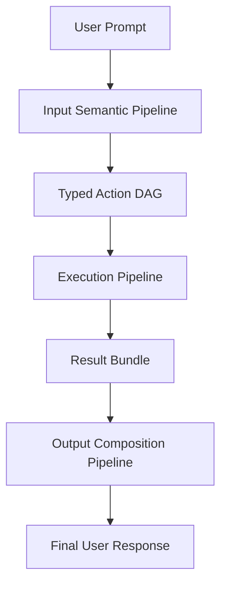
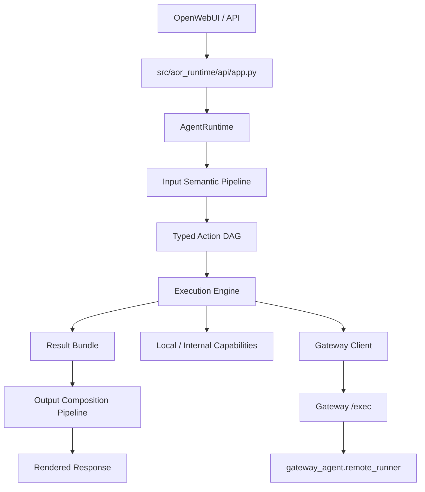
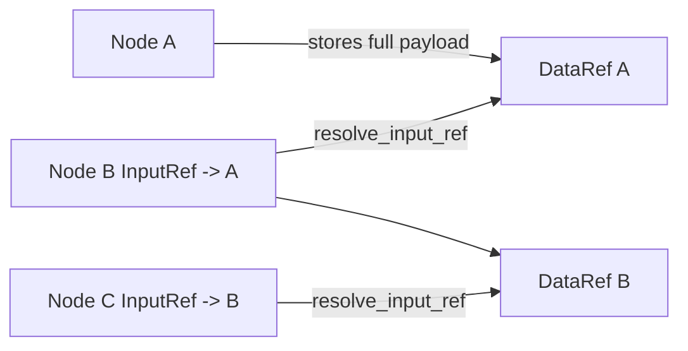
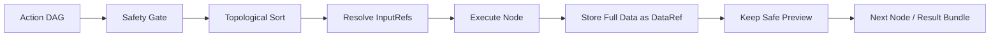
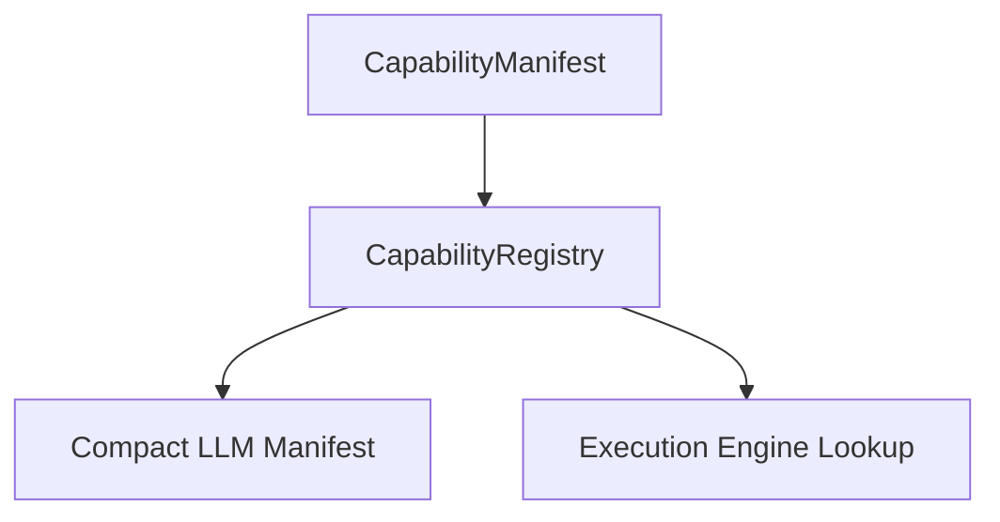
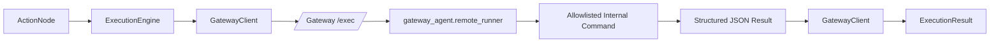
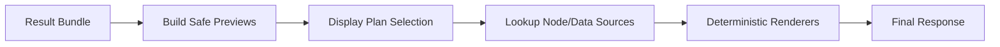

# Agent Runtime Architecture

This document explains the current `agent_runtime` architecture in practical terms.

It is intentionally grounded in the code that exists today, not an aspirational future design.

The system is organized around three major pipelines:

1. Input Semantic Pipeline
2. Execution Pipeline
3. Output Composition Pipeline

At the highest level, the architecture follows one core rule:

> The LLM decides meaning.  
> The runtime enforces structure and safety.  
> The gateway touches the real environment.


## Why This System Exists

This is not a free-form "LLM writes commands" agent.

Instead, it is a schema-driven runtime where:

- the LLM interprets user intent into typed structures;
- the runtime validates, normalizes, and constrains those structures;
- the execution engine runs a typed action graph;
- environment-facing capabilities run through the gateway;
- rendering stays local and deterministic.

That separation matters because it gives us:

- a real safety boundary;
- clearer debugging;
- a cleaner path to adding capabilities;
- deployment flexibility when the runtime is not on the machine that should do the work.


## High-Level Mental Model



In plain English:

1. We receive a natural-language prompt.
2. The LLM turns it into typed semantic decisions.
3. The runtime converts those decisions into a validated DAG of actions.
4. The engine executes those actions safely.
5. Full outputs are stored as typed references.
6. Only safe previews are used for output planning.
7. The runtime renders the final answer.


## System Block Diagram




## Repository Map

The major pieces live here:

- API entrypoint:
  - [src/aor_runtime/api/app.py](/home/vraj/Desktop/workspace/openfabric/src/aor_runtime/api/app.py)
- Top-level runtime orchestrator:
  - [src/agent_runtime/core/orchestrator.py](/home/vraj/Desktop/workspace/openfabric/src/agent_runtime/core/orchestrator.py)
- Core typed models:
  - [src/agent_runtime/core/types.py](/home/vraj/Desktop/workspace/openfabric/src/agent_runtime/core/types.py)
- Input semantic stages:
  - [src/agent_runtime/input_pipeline](/home/vraj/Desktop/workspace/openfabric/src/agent_runtime/input_pipeline)
- Capability contracts and registry:
  - [src/agent_runtime/capabilities](/home/vraj/Desktop/workspace/openfabric/src/agent_runtime/capabilities)
- Execution:
  - [src/agent_runtime/execution](/home/vraj/Desktop/workspace/openfabric/src/agent_runtime/execution)
- Output composition:
  - [src/agent_runtime/output_pipeline](/home/vraj/Desktop/workspace/openfabric/src/agent_runtime/output_pipeline)
- Gateway app and remote tool runner:
  - [gateway_agent/app.py](/home/vraj/Desktop/workspace/openfabric/gateway_agent/app.py)
  - [gateway_agent/remote_runner.py](/home/vraj/Desktop/workspace/openfabric/gateway_agent/remote_runner.py)


## Top-Level Request Flow

The main runtime flow is implemented in [src/agent_runtime/core/orchestrator.py](/home/vraj/Desktop/workspace/openfabric/src/agent_runtime/core/orchestrator.py).

`AgentRuntime.handle_request(...)` does this:

1. create a `UserRequest`;
2. classify the prompt;
3. short-circuit simple no-tool questions into a placeholder direct-answer path;
4. decompose the prompt into tasks;
5. assign semantic verbs;
6. select capabilities;
7. extract typed arguments;
8. build the action DAG;
9. evaluate DAG safety;
10. execute the DAG;
11. compose the final output.

That means the orchestrator owns the pipeline, but not the details of each stage.


## Core Typed Contracts

The most important architectural improvement in this system is that it now has a real typed backbone.

Primary models live in [src/agent_runtime/core/types.py](/home/vraj/Desktop/workspace/openfabric/src/agent_runtime/core/types.py).

### Request / Semantics

- `UserRequest`
  - raw prompt plus user/session/safety context
- `TaskFrame`
  - one semantic task extracted from the prompt
- `CapabilityRef`
  - a candidate capability match for a task

### Execution Planning

- `ActionNode`
  - one executable node with capability, args, dependencies, and safety labels
- `ActionDAG`
  - validated action graph

### Typed Dataflow

- `InputRef`
  - typed reference from one node argument to another node's output
- `DataRef`
  - typed handle for one stored execution payload

### Execution Results

- `ExecutionResult`
  - result for one node
- `ResultBundle`
  - aggregate result for the DAG

### Output Planning

- `DisplayPlan`
  - chosen output style and section plan
- `RenderedOutput`
  - final rendered text plus metadata


## Input Semantic Pipeline

The input pipeline turns raw language into a typed action graph.

It is the most LLM-heavy part of the runtime.


## Where the LLM Is Used

The current runtime uses the LLM in six active stages.

All structured LLM calls flow through:

- [src/agent_runtime/llm/client.py](/home/vraj/Desktop/workspace/openfabric/src/agent_runtime/llm/client.py)
- [src/agent_runtime/llm/structured_call.py](/home/vraj/Desktop/workspace/openfabric/src/agent_runtime/llm/structured_call.py)

The runtime pattern is:

1. build a stage-specific prompt;
2. require JSON-only output;
3. validate against a Pydantic model;
4. apply deterministic post-processing and safety checks.


### Stage 1: Prompt Classification

File:

- [src/agent_runtime/input_pipeline/decomposition.py](/home/vraj/Desktop/workspace/openfabric/src/agent_runtime/input_pipeline/decomposition.py)

Function:

- `classify_prompt(...)`

The LLM decides:

- prompt type:
  - `simple_question`
  - `simple_tool_task`
  - `compound_tool_task`
  - `complex_workflow`
  - `ambiguous`
  - `unsupported`
- whether tools are needed;
- likely domains;
- risk level;
- whether clarification is needed.

The runtime then:

- validates the `PromptClassification` schema;
- applies a small deterministic normalization layer for obvious system prompts such as:
  - `pwd`
  - `current working directory`
  - `git status`
  - `which`
  - process inspection
  - port inspection
  - readonly test-running prompts

Why this stage exists:

- it gives the runtime a first routing decision;
- it lets obvious no-tool questions short-circuit;
- it provides early domain hints.


### Stage 2: Task Decomposition

File:

- [src/agent_runtime/input_pipeline/decomposition.py](/home/vraj/Desktop/workspace/openfabric/src/agent_runtime/input_pipeline/decomposition.py)

Function:

- `decompose_prompt(...)`

The LLM decides:

- how many user-meaningful tasks exist;
- task descriptions;
- task dependencies and ordering;
- global constraints.

Examples of global constraints:

- path hints;
- limits;
- date ranges;
- output preferences;
- table names;
- row limits;
- safety hints.

The runtime then:

- validates that dependency references are well formed.

Why this stage exists:

- it converts one natural-language prompt into a typed task set.


### Stage 3: Semantic Verb Assignment

File:

- [src/agent_runtime/input_pipeline/verb_classification.py](/home/vraj/Desktop/workspace/openfabric/src/agent_runtime/input_pipeline/verb_classification.py)

Function:

- `assign_semantic_verbs(...)`

The LLM decides:

- one controlled semantic verb per task:
  - `read`
  - `search`
  - `create`
  - `update`
  - `delete`
  - `transform`
  - `analyze`
  - `summarize`
  - `compare`
  - `execute`
  - `render`
  - `unknown`
- `object_type`
- `intent_confidence`
- `risk_level`
- `requires_confirmation`

The runtime then:

- normalizes risk rules;
- forces delete-like tasks to require confirmation;
- keeps read/search/analyze/summarize/render low-risk by default;
- raises `execute` out of low-risk unless there is a good reason not to.

Why this stage exists:

- it gives each task a stable semantic shape before capability matching.


### Stage 4: Capability Selection

File:

- [src/agent_runtime/input_pipeline/domain_selection.py](/home/vraj/Desktop/workspace/openfabric/src/agent_runtime/input_pipeline/domain_selection.py)

Function:

- `select_capabilities(...)`

The LLM sees:

- one task at a time;
- the compact exported capability manifest.

The LLM decides:

- ranked candidate capabilities;
- the selected capability;
- confidence;
- reasoning.

Example:

```json
{
  "capability_id": "shell.git_status",
  "operation_id": "git_status",
  "confidence": 0.92,
  "reason": "The task asks for repository status information."
}
```

The runtime then:

- checks the capability exists;
- checks the operation id matches the manifest;
- rejects low-confidence matches;
- rejects semantic-verb mismatches unless the justification is unusually strong.

Why this stage exists:

- this is where user meaning becomes a concrete tool identity.


### Stage 5: Argument Extraction

File:

- [src/agent_runtime/input_pipeline/argument_extraction.py](/home/vraj/Desktop/workspace/openfabric/src/agent_runtime/input_pipeline/argument_extraction.py)

Function:

- `extract_arguments(...)`

The LLM sees:

- task description;
- global constraints;
- selected capability manifest;
- required arguments;
- optional arguments;
- examples.

The LLM decides:

- typed arguments for the chosen capability.

Example:

```json
{
  "path": "."
}
```

The runtime then:

- normalizes current-directory phrases like `this folder`, `here`, and `current directory`;
- clamps limits;
- blocks path traversal;
- applies defaults like `limit=100` or `limit=1000` where appropriate;
- marks missing required args;
- refuses execution if the required args are still missing.

Why this stage exists:

- it converts natural language into typed capability arguments without allowing the LLM to become the command authority.


### Stage 6: Display Plan Selection

Files:

- [src/agent_runtime/output_pipeline/display_selection.py](/home/vraj/Desktop/workspace/openfabric/src/agent_runtime/output_pipeline/display_selection.py)
- [src/agent_runtime/output_pipeline/orchestrator.py](/home/vraj/Desktop/workspace/openfabric/src/agent_runtime/output_pipeline/orchestrator.py)

Function:

- `select_display_plan(...)`

The LLM sees:

- original prompt;
- compact DAG summary;
- compact result summary;
- safe previews only;
- available display types.

The LLM decides:

- whether the result should render as:
  - `plain_text`
  - `markdown`
  - `table`
  - `json`
  - `code_block`
  - `multi_section`
- how sections should be labeled and sourced.

The runtime then:

- validates that the display plan only references existing safe sources;
- resolves payloads deterministically;
- renders the final text locally.

Why this stage exists:

- it lets output shape adapt to the task without giving the LLM access to raw full results.


## What the LLM Does Not Control

The LLM does **not** control:

- shell command construction;
- gateway routing;
- path normalization;
- safety policy;
- cycle detection;
- dependency validation;
- `InputRef` resolution;
- full result storage;
- gateway remote execution;
- deterministic rendering.

Those are all runtime-owned or gateway-owned.


## Action DAG and Validation

The action DAG is the contract between semantic planning and execution.

Primary model:

- [ActionDAG](/home/vraj/Desktop/workspace/openfabric/src/agent_runtime/core/types.py)

Each `ActionNode` contains:

- `id`
- `task_id`
- `description`
- `semantic_verb`
- `capability_id`
- `operation_id`
- `arguments`
- `depends_on`
- `safety_labels`
- `dry_run`

### DAG Validation Rules

The runtime enforces:

- node ids must be unique;
- dependencies must point to existing nodes;
- the graph must be acyclic;
- `unknown` capabilities must be explicitly marked unresolved;
- every `InputRef` producer must exist;
- every `InputRef` producer must be in the dependency chain.

That validation lives mainly in:

- [src/agent_runtime/core/types.py](/home/vraj/Desktop/workspace/openfabric/src/agent_runtime/core/types.py)


## Typed Dataflow: InputRef and DataRef

This is one of the most important newer pieces of the architecture.

The runtime now supports workflows where one node consumes the output of another node through a typed reference rather than through raw prompt text or hand-wired runtime state.



### DataRef

`DataRef` represents:

- a stable `ref_id`;
- the producer node id;
- a coarse `data_type`;
- a safe preview;
- metadata.

### InputRef

`InputRef` represents:

- `source_node_id`
- optional `output_key`
- optional `expected_data_type`

### Why this matters

This turns the DAG into a real workflow graph:

- upstream outputs can feed downstream nodes;
- the engine can validate dataflow explicitly;
- the runtime can keep full data private while still making workflows possible.


## Execution Pipeline

The execution pipeline is the deterministic heart of the runtime.



Primary files:

- [src/agent_runtime/execution/engine.py](/home/vraj/Desktop/workspace/openfabric/src/agent_runtime/execution/engine.py)
- [src/agent_runtime/execution/safety.py](/home/vraj/Desktop/workspace/openfabric/src/agent_runtime/execution/safety.py)
- [src/agent_runtime/execution/result_store.py](/home/vraj/Desktop/workspace/openfabric/src/agent_runtime/execution/result_store.py)


## Safety Gate

Before execution, the runtime evaluates the DAG through:

- `evaluate_dag_safety(...)`

The safety gate enforces rules such as:

- unknown capabilities are blocked;
- delete operations require confirmation;
- update/create operations require confirmation unless allowlisted low-risk;
- shell execution is blocked unless configuration enables it;
- environment-facing capabilities must be gateway-backed;
- paths must stay inside workspace root;
- obvious secret files are blocked;
- output preview size is bounded;
- SQL writes are blocked unless explicitly supported and confirmed.

This is a runtime safety boundary, not an LLM decision.


## Execution Engine Responsibilities

The engine does the following in order:

1. evaluate DAG safety;
2. return structured error bundles when blocked;
3. topologically sort the DAG;
4. execute nodes in dependency order;
5. skip downstream nodes when required upstream nodes fail;
6. resolve any `InputRef` arguments before execution;
7. execute through the correct backend;
8. store successful payloads as `DataRef`;
9. attach only safe previews to the `ExecutionResult`;
10. return a `ResultBundle`.

### InputRef Resolution Rules

Before executing a node, the engine:

- checks that each referenced producer is in the dependency chain;
- checks that the producer actually executed;
- checks that the producer succeeded;
- checks that the stored `data_type` matches `expected_data_type` when one is declared;
- resolves the full data from the `ResultStore`.

That means downstream execution is deterministic and typed, even if the upstream planning came from the LLM.


## Result Store

Primary file:

- [src/agent_runtime/execution/result_store.py](/home/vraj/Desktop/workspace/openfabric/src/agent_runtime/execution/result_store.py)

Responsibilities:

- stores full successful payloads by `DataRef`;
- returns full data for deterministic downstream execution;
- resolves `InputRef`;
- generates bounded JSON-safe previews;
- keeps previews separate from full data.

This is one of the strongest safety boundaries in the current system:

> downstream deterministic execution can use full stored data,  
> but LLM-based output planning only sees safe previews by default.


## Capability System

Capabilities are the bridge between semantic meaning and executable behavior.

Primary files:

- [src/agent_runtime/capabilities/schemas.py](/home/vraj/Desktop/workspace/openfabric/src/agent_runtime/capabilities/schemas.py)
- [src/agent_runtime/capabilities/registry.py](/home/vraj/Desktop/workspace/openfabric/src/agent_runtime/capabilities/registry.py)
- [src/agent_runtime/capabilities/__init__.py](/home/vraj/Desktop/workspace/openfabric/src/agent_runtime/capabilities/__init__.py)

### Capability Manifest

Each capability declares:

- `capability_id`
- `domain`
- `operation_id`
- `name`
- `description`
- `semantic_verbs`
- `object_types`
- `argument_schema`
- `required_arguments`
- `optional_arguments`
- `output_schema`
- `execution_backend`
- `backend_operation`
- `risk_level`
- `read_only`
- `mutates_state`
- `requires_confirmation`
- `examples`
- `safety_notes`

### Capability Exposure Diagram



### What the LLM Sees

The LLM sees only a compact safe export containing:

- `capability_id`
- `operation_id`
- `domain`
- `description`
- `semantic_verbs`
- `object_types`
- `required_arguments`
- `optional_arguments`
- `risk_level`
- `read_only`
- `examples`

### What the LLM Does Not See

The LLM does **not** see:

- command templates;
- shell commands;
- gateway transport details;
- backend operation names;
- execution backend routing rules;
- implementation code.

That boundary is deliberate. The model chooses semantic tools, not execution transport.


## Current Capability Inventory

The default registry is built in:

- [src/agent_runtime/capabilities/__init__.py](/home/vraj/Desktop/workspace/openfabric/src/agent_runtime/capabilities/__init__.py)

### Filesystem

Gateway-backed:

- `filesystem.list_directory`
- `filesystem.read_file`
- `filesystem.search_files`

These are environment-facing, so they execute remotely through the gateway.

### Shell

Gateway-backed and constrained:

- `shell.which`
- `shell.pwd`
- `shell.list_processes`
- `shell.check_port`
- `shell.git_status`
- `shell.run_tests_readonly`

These are read-only capabilities with typed argument schemas. The runtime never treats the LLM as the command authority.

### SQL

Local / placeholder:

- `sql.read_query`

This currently accepts structured query intent rather than arbitrary LLM-generated SQL. It is not yet a full DICOM/SQL execution layer.

### Local Data Processing

Local:

- `python_data.transform_table`

This performs deterministic in-memory transforms on already available structured data.

### Rendering

Internal:

- `markdown.render`

This is an output capability, not an environment-touching capability.


## Backend Routing Model

One of the important design choices in the runtime is that semantic identity and execution transport are separate.

The LLM chooses:

- `filesystem.read_file`
- `shell.git_status`
- `markdown.render`

The runtime then routes by manifest backend:

- `gateway`
- `local`
- `internal`

That routing decision is runtime-owned, not LLM-owned.


## Gateway-Backed Execution

Environment-facing tools execute through the gateway.

Primary files:

- [src/agent_runtime/execution/gateway_client.py](/home/vraj/Desktop/workspace/openfabric/src/agent_runtime/execution/gateway_client.py)
- [gateway_agent/app.py](/home/vraj/Desktop/workspace/openfabric/gateway_agent/app.py)
- [gateway_agent/remote_runner.py](/home/vraj/Desktop/workspace/openfabric/gateway_agent/remote_runner.py)



### Why the gateway exists

The runtime may run:

- in Docker;
- in a control-plane service;
- on a machine that should not directly access the target environment.

The gateway acts as remote hands.

So the split is:

- runtime chooses semantic tool;
- runtime enforces safety and typed arguments;
- gateway performs actual environment access.


## Remote Runner Model

The remote runner lives in:

- [gateway_agent/remote_runner.py](/home/vraj/Desktop/workspace/openfabric/gateway_agent/remote_runner.py)

It accepts:

- `--operation`
- `--payload` (base64 JSON)

It then:

1. validates the operation against an allowlist;
2. validates required and optional arguments;
3. normalizes the path/workspace context;
4. executes an internally constructed command or filesystem action;
5. emits one structured JSON envelope.

This is a crucial design point:

> The gateway does not execute prompt-derived shell text.  
> It executes runtime-chosen operations with runtime-validated arguments.


## Constrained Shell Family

The shell family is intentionally narrow and hardcoded for safety.

The LLM may say:

```json
{
  "capability_id": "shell.check_port",
  "arguments": {
    "port": 8310
  }
}
```

But the LLM may **not** say:

```text
lsof -i :8310
```

The actual command construction happens internally inside the remote runner.

That is one of the strongest boundaries in the current system.


## Output Composition Pipeline

The output pipeline turns typed execution results into the final user-visible answer.



Primary files:

- [src/agent_runtime/output_pipeline/orchestrator.py](/home/vraj/Desktop/workspace/openfabric/src/agent_runtime/output_pipeline/orchestrator.py)
- [src/agent_runtime/output_pipeline/display_selection.py](/home/vraj/Desktop/workspace/openfabric/src/agent_runtime/output_pipeline/display_selection.py)
- [src/agent_runtime/output_pipeline/renderers.py](/home/vraj/Desktop/workspace/openfabric/src/agent_runtime/output_pipeline/renderers.py)

### Output behavior

- error bundles render deterministically;
- partial bundles render deterministically;
- only success bundles invoke LLM-guided display selection;
- safe previews are redacted before display planning;
- full stored data is only dereferenced if policy explicitly allows it.

### Important safety boundary

By default:

- the display-planning LLM sees only safe previews;
- it does not see full stored payloads;
- it does not see raw gateway stdout/stderr unless those were already normalized into safe structured previews.


## Concrete End-to-End Example: Git Status

Prompt:

`show git status for this repository`

### Step-by-step

1. The API layer receives the prompt through `/v1/chat/completions`.
2. `AgentRuntime` builds a `UserRequest`.
3. The LLM classifies the prompt as a tool-backed request.
4. The LLM decomposes it into a task.
5. The LLM assigns a semantic verb such as `read` or `analyze`.
6. The LLM selects `shell.git_status`.
7. The LLM extracts arguments, usually `{"path": "."}`.
8. The runtime builds a one-node DAG.
9. The safety gate verifies shell policy, path constraints, and backend rules.
10. The execution engine routes the node to the gateway because the capability backend is `gateway`.
11. The gateway client builds a deterministic invocation of `python3 -m gateway_agent.remote_runner ...`.
12. The remote runner validates the operation and internally constructs:

```text
git -C <repo_path> status --short --branch
```

13. The remote runner returns a structured JSON envelope with parsed status lines.
14. The execution engine stores the full result in `ResultStore` as a `DataRef`.
15. The output pipeline builds safe previews from the result bundle.
16. The display-planning LLM chooses a display plan using only safe previews.
17. Deterministic renderers produce the final response shown to the user.


## What Is Flexible

These are the strongest, most flexible parts of the current architecture.

### 1. Typed contracts

The system has real typed objects for:

- semantics;
- planning;
- execution;
- dataflow;
- result bundling;
- output planning.

That gives the runtime a real backbone.

### 2. Capability registry

New capabilities can be added through manifests and registration, rather than rewriting the whole pipeline.

### 3. Backend abstraction

The same semantic capability pattern supports:

- `gateway`
- `local`
- `internal`

This cleanly separates meaning from transport.

### 4. Gateway as remote substrate

Environment-facing work is decoupled from the machine that hosts the agent runtime.

### 5. Typed result references

`InputRef` and `DataRef` make true workflows possible without exposing full result payloads to the LLM.


## What Is Hardcoded

Some hardcoding is intentional and good. Some is temporary and pragmatic.

### 1. The constrained shell family

Allowed shell operations are explicitly enumerated in the remote runner. This is good hardcoding because it limits blast radius.

### 2. Classification rescue rules

Some obvious shell/system prompts are explicitly normalized after LLM classification. This is pragmatic, but not the long-term ideal.

### 3. Data type inference

The execution engine still infers coarse output types from payload shapes like:

- `rows`
- `entries`
- `processes`
- `listeners`
- `content_preview`
- `summary`
- `value`

That works, but it is still heuristic.

### 4. Renderer knowledge of payload families

The renderers know about specific payload keys:

- `entries`
- `rows`
- `matches`
- `processes`
- `listeners`
- `status_lines`
- `stdout_lines`
- `stderr_lines`

This is effective, but not fully generalized.

### 5. Gateway defaults and config bridging

Some gateway fallback behavior and shell-mode bridging are explicit in code today rather than arising from a more unified configuration abstraction.


## What Is Brittle

This is the honest part of the architecture.

### 1. Semantic edge reliability

The LLM-driven stages are structured, but some prompt families still need deterministic rescue logic. That means the semantic contract is good, but not yet fully self-sufficient.

### 2. Capability breadth

The architecture is stronger than the current capability surface.

Today the runtime is strongest in:

- filesystem;
- constrained shell;
- markdown rendering;
- deterministic local table transforms.

It is still weaker in:

- rich SQL/DICOM execution;
- broad cross-domain workflows;
- deeper natural-language-to-dataflow inference.

### 3. Output generalization

Display selection is flexible, but the deterministic renderers still rely on some payload-family knowledge.

### 4. Environment topology effects

Some capabilities depend on what the gateway host can actually observe.

Example:

- `shell.check_port` can behave differently depending on process namespace visibility.

That is a deployment/topology issue as much as a software issue.

### 5. Prompt-to-dataflow planning depth

The runtime now supports typed dataflow well, but the planner is still only moderately smart about turning rich compound prompts into multi-step `InputRef`-driven workflows automatically.


## Current Architectural Maturity

If we summarize the current state plainly:

### Strong today

- typed request -> DAG -> result pipeline
- capability registry
- gateway-backed environment execution
- constrained shell family
- safe preview boundary
- typed `InputRef` / `DataRef` dataflow
- local deterministic rendering

### Medium today

- prompt classification robustness
- capability selection accuracy at the edges
- output generality
- rich multi-step dataflow planning from natural language

### Weaker today

- SQL/DICOM depth
- large capability surface coverage
- broad compound workflow coverage across many domains


## One-Sentence Summary

If we had to explain this runtime to another engineer in one sentence:

> This is a schema-driven agent runtime where the LLM proposes typed meaning, the runtime validates and executes a safe action DAG, the gateway performs environment-facing work remotely, and the runtime renders the final answer from safe structured results.
